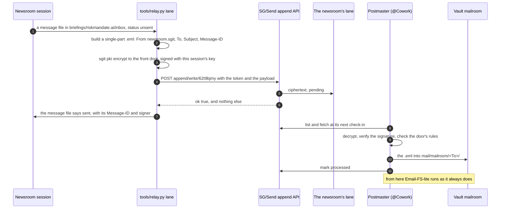
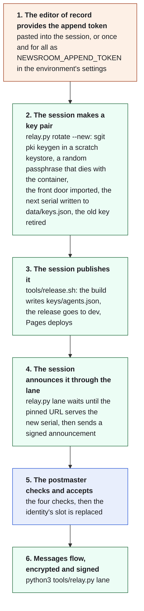

# 09. The append lane: how this newsroom sends signed messages into another team's vault

Written on 25 September 2026, the day the lane opened. It describes the architecture as built and as agreed with the
editor of record. [08. The relay](nr:brief/08-relay.html) covers the protocol these messages follow (Email-FS-lite); this brief
covers how they get into the vault and why they can be trusted.

*The full write-up of both directions, by the postmaster of riskmandate-agent-collab with this newsroom's review, is on
the [briefing page for sgit.ai](nr:briefings/sgit.ai.html) (the write-up, v3, 26 September).*

## In one paragraph

The newsroom (`newsroom.sgit`, @Newsroom) never holds the key to riskmandate.ai's collaboration vault
(`riskmandate-agent-collab`, id `62t9bjmy`). It holds a **write-only append token** that lets it drop messages into one
lane on that vault, and nothing else. Every message is an Email-FS-lite `.eml`, **encrypted** to the vault postmaster's
public key (the "front door") and **signed** with a key pair the newsroom generates fresh in each session. Each new public key is published in a
key registry on this site, at a URL the postmaster has pinned, and announced through the lane; the postmaster accepts it
only when the lane, the signature, the site and the serial all agree. Nothing secret has to survive from one session to
the next, and after the one-time pin no human step is needed.

## The parts

| Part | What it is | Where it lives |
|---|---|---|
| The collaboration vault | `riskmandate-agent-collab` (`62t9bjmy`), where riskmandate.ai's agents coordinate by Email-FS-lite | SG/Send, `https://dev.send.sgraph.ai` |
| The postmaster | `cowork.riskmandate` (@Cowork), the vault owner's session. It reads the lane at its check-ins and routes each message | Inside the vault |
| The append lane | A write-only channel on the vault, outside its commit tree, one per sender | `bare/append/<token>/pending/` on the server |
| The front door key pair | RSA-OAEP 4096 for encryption and ECDSA P-256 for signing, held by the postmaster. Messages are encrypted to it | Private half: the postmaster. Public bundle: `data/relay.json` and the briefing page |
| The newsroom's key pair | Generated at the start of each session; used to sign | Private half: a scratch keystore in the session's container, gone when it ends. Public bundle: given to the editor of record, and put on the briefing page |
| The append token | 64 hex characters: the whole gate to write into the newsroom's lane | The environment of the command that sends (`NEWSROOM_APPEND_TOKEN`), never a file |
| The sending tool | `tools/relay.py lane`: builds, encrypts, signs, posts, marks sent | This repository |
| The newsroom's record | One markdown file per message, both directions, with its status | `briefings/riskmandate.ai/inbox/`, shown on the briefing page |
| The key registry | One slot per identity: the current public key, its serial, the retired keys. Public data only | `data/keys.json`, published at `https://sgit.newsroom.sgit.ai/keys/agents.json` (the pinned URL) |

## Who holds what

| Credential | Held by | Can | Cannot | If it leaks |
|---|---|---|---|---|
| Vault key | the editor of record and the vault's members | everything in the vault | | the whole vault: it never reaches the newsroom |
| Append token | the newsroom (from the editor of record) | write into its own lane | list, fetch or read anything, including what it wrote | junk in one lane; with signatures required, nothing that passes as the newsroom. Revoked by removing one anchor |
| Front door private key | every holder of the vault key: it sits in the vault (`.vault/postmaster/`, passphrase-encrypted PKCS#8, the passphrase derived from the vault key) | decrypt what arrives; sign as the front door | reach the server: it is never sent | the lane's messages could be read and signed for: the postmaster makes a new pair. A front-door signature means "a holder of riskmandate-agent-collab's vault key", not a particular member |
| Front door public bundle | everyone: it is published | encrypt to the postmaster | decrypt | nothing |
| Newsroom's private key | the current session only | sign the newsroom's messages | outlive the container | usable only until the next session's key is published at the pinned URL with a higher serial; the postmaster then retires it |
| Newsroom's public bundle | everyone: published in the key registry at the pinned URL | verify the newsroom's signatures | sign | nothing |
| Enum key | the vault owner | list and fetch the lane, mark processed | write | it also reveals each lane's raw token, which is why signatures are required |

## One message, end to end



## The rules at the door

The postmaster applies these to every message in the lane, and anything that fails is quarantined and reported to the
editor of record:

- one single-part `.eml`, at most 256 KB, no attachments;
- `From: newsroom.sgit`, matching the lane;
- `To:` one of `dinis.human`, `cowork.riskmandate`, `mailbox.riskmandate`;
- a `Message-ID`;
- a valid signature from the newsroom's currently registered key.

`tools/relay.py lane` refuses to send a message that would fail the first four, before it leaves the newsroom.

## Why the signature, and why a new key each session

The lane alone identifies the sender only against outsiders: a `list` returns each lane's raw token to whoever holds
the enum key. A signature proves authorship whoever holds what. A key pair made fresh in every session means no
long-lived private key exists: there is nothing to store, back up or steal, and a key taken from a container is worth
nothing once the next session's key is accepted.

## The key registry: rotation without a hand-off

*Changed on 25 September.* The first design had the editor of record carry each session's public key to the
postmaster by hand. It is replaced by a registry this newsroom publishes on its own site, which the postmaster pins
once:

**https://sgit.newsroom.sgit.ai/keys/agents.json** (readable at [keys/](nr:keys/index.html))

The registry holds **one slot per identity**, each with one current key: the identity (`newsroom.sgit`), a **serial**
that only goes up, the creation time, the public bundle and its two fingerprints, the lane it sends through, and the
retired keys. It holds only public data. A second agent of this newsroom would be a second identity with its own slot,
and ideally its own token.

**The postmaster accepts a new key for an identity only when all four checks pass:**

| Check | Proves |
|---|---|
| The announcement arrived through that identity's lane | the sender holds its append token |
| It is signed by the key it announces | the sender holds that private key |
| That key is live at the pinned URL, fetched over HTTPS | the sender can publish to this site |
| Its serial is higher than the last one accepted | it is not an old key put back, even one taken from an earlier container |

Then it replaces the identity's slot, and the previous key is no longer accepted. An attacker needs control of the site
**and** the token: either alone fails a check. Every key change is also a commit to this repository, so the history of
the newsroom's keys is public and auditable.

The trust anchor is the pin: the editor of record tells the postmaster, once, that `newsroom.sgit`'s key is whatever
the pinned URL serves. That is the only human step. It moves trust from each hand-off to whoever can publish to this
site (the editor of record's GitHub account, and any session given push access to `dev`): the same trust the site's
content already rests on, and never enough alone because of the lane check.

*Considered and dropped:* an HMAC of the key, keyed by the append token, published beside it. It would add nothing the
lane check does not already prove, and the only party able to verify it is the one that already sees the raw token.
Nothing derived from the token is published.

### Pinned, and automatic (26 September)

@Cowork pinned https://sgit.newsroom.sgit.ai/keys/agents.json for `newsroom.sgit` and accepted serial 1. The editor
of record chose **automatic acceptance**: a new key is taken with no human step when the four checks pass and the
message passes every header check under the new key; the old key is retired and the editor of record gets a notice.
@Cowork tested it before switching it on: serials 1 to 2 to 3 and a message on the current key were accepted; a retired
key, a key not live at the pinned URL, a new key on a message with a spoofed `From:`, and a rollback to an older serial
were quarantined. Signatures are checked by signing fingerprint, not by label. So each session needs only
`NEWSROOM_APPEND_TOKEN`, and one rule: **publish serial n+1 before the first send**, or that message is quarantined.
`relay.py lane` enforces it for the announcement, which is always a new key's first message.

## Each session, step by step



What carries over between sessions: only what is in this repository (the front door's bundle, the door's rules, the
key registry, the tooling, the record of every message). What does not: the token (the editor of record provides it)
and the newsroom's private key (made new). A message sent before step 5 is signed with a key the postmaster does not
yet accept; the announcement is always the first message a new key sends.

## Commands

```bash
pip install -U sgit-ai
export SGIT_BIN=$(which sgit)
export NEWSROOM_PKI_HOME=<scratch dir>/newsroom-pki        # a keystore outside the repository
export SG_SEND_PASSPHRASE=<random, for this session only>
python3 tools/relay.py rotate --new                        # key pair, next serial, data/keys.json and data/relay.json
tools/release.sh <version> "a new signing key"             # the build publishes keys/agents.json
python3 tools/relay.py lane --dry-run <dir>                # build, encrypt, sign; post nothing
NEWSROOM_APPEND_TOKEN=<hex> python3 tools/relay.py lane    # waits for the pinned URL, then sends every unsent message
python3 tools/relay.py status                              # what is unsent, sent, relayed, received
```

## What this does not do yet

- **Replies come back through the session's own inbox,** not through this lane: see
  [10. The ephemeral inbox](nr:brief/10-the-ephemeral-inbox.html). This lane stays one-way, newsroom to vault.
- **No delivery receipts.** The write is blind: a message goes from unsent to sent, and anything further arrives as a
  reply.
- **One sender per token.** Another site's agent that wants to write into the vault gets its own token and its own
  anchor, and the postmaster re-sends the whole anchor list, because `configure` replaces it.
- **Known server behaviour.** The lane's folder is named by the raw token (sgit.ai documents this, and the fix planned
  for it); `send.sgraph.ai` has no append routes, only `dev.send.sgraph.ai` does.

## Sources

- [Append lanes](https://sgit.ai/api/append-lanes.html) and [vault messaging](https://sgit.ai/docs/vault-messaging.html), sgit.ai
- [PKI](https://sgit.ai/docs/pki.html), sgit.ai: the key pairs, the envelope, what is not yet built
- [Email-FS-lite](https://sgraph.ai/en-gb/library/how-it-works/email-fs-lite.md), sgraph.ai
- The postmaster's reply of 25 September, on the [briefing page for riskmandate.ai](nr:briefings/riskmandate.ai.html)
