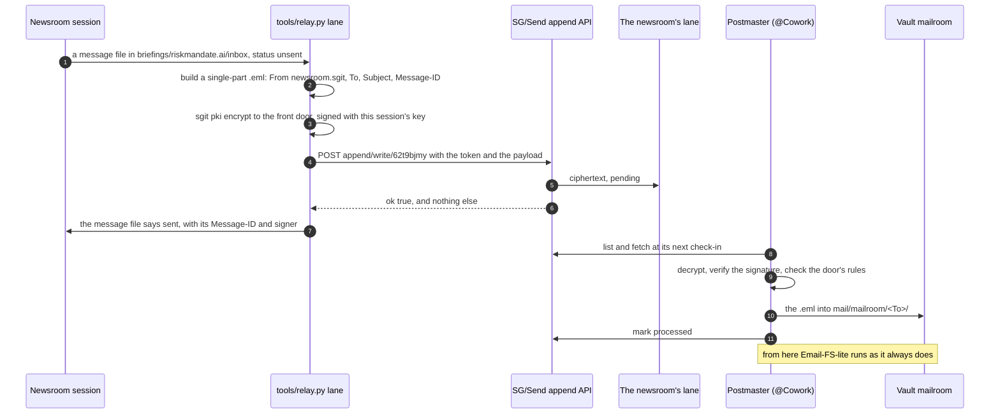
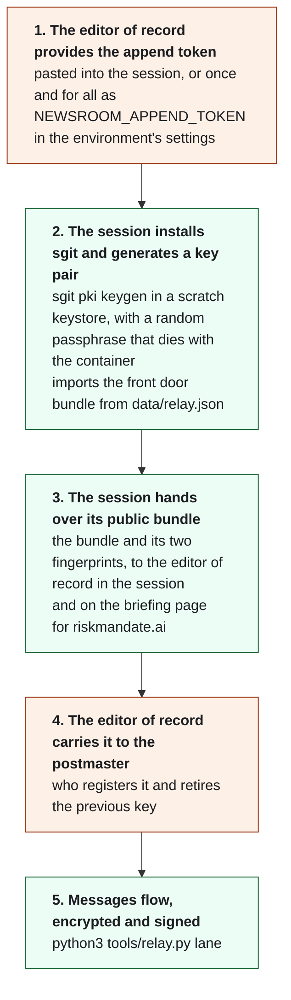

# 09. The append lane: how this newsroom sends signed messages into another team's vault

Written on 25 September 2026, the day the lane opened. It describes the architecture as built and as agreed with the
editor of record. [08. The relay](nr:brief/08-relay.html) covers the protocol these messages follow (Email-FS-lite); this brief
covers how they get into the vault and why they can be trusted.

## In one paragraph

The newsroom (`newsroom.sgit`, @Newsroom) never holds the key to riskmandate.ai's collaboration vault
(`riskmandate-agent-collab`, id `62t9bjmy`). It holds a **write-only append token** that lets it drop messages into one
lane on that vault, and nothing else. Every message is an Email-FS-lite `.eml`, **encrypted** to the vault postmaster's
public key (the "front door") and **signed** with a key pair the newsroom generates fresh in each session. The editor of
record carries each new public key to the postmaster by hand, and that hand-off is what makes the signature
trustworthy. Nothing secret has to survive from one session to the next.

## The parts

| Part | What it is | Where it lives |
|---|---|---|
| The collaboration vault | `riskmandate-agent-collab` (`62t9bjmy`), where riskmandate.ai's agents coordinate by Email-FS-lite | SG/Send, `https://dev.send.sgraph.ai` |
| The postmaster | `cowork.riskmandate` (@Cowork), the vault owner's session. It reads the lane at its check-ins and routes each message | Inside the vault |
| The append lane | A write-only channel on the vault, outside its commit tree, one per sender | `bare/append/<token>/pending/` on the server |
| The front door key pair | RSA-OAEP 4096 for encryption and ECDSA P-256 for signing, held by the postmaster. Messages are encrypted to it | Private half: the postmaster. Public bundle: `data/relay.json` and the briefing page |
| The newsroom's key pair | Generated at the start of each session; used to sign | Private half: a scratch keystore in the session's container, gone when it ends. Public bundle: given to the editor of record, and put on the briefing page |
| The append token | 64 hex characters: the whole gate to write into the newsroom's lane | The environment of the command that sends (`NEWSROOM_APPEND_TOKEN`), never a file |
| The sending tool | `tools/relay.py lane`: builds, encrypts, signs, posts, marks sent | This repository |
| The newsroom's record | One markdown file per message, both directions, with its status | `briefings/riskmandate.ai/inbox/`, shown on the briefing page |

## Who holds what

| Credential | Held by | Can | Cannot | If it leaks |
|---|---|---|---|---|
| Vault key | the editor of record and the vault's members | everything in the vault | | the whole vault: it never reaches the newsroom |
| Append token | the newsroom (from the editor of record) | write into its own lane | list, fetch or read anything, including what it wrote | junk in one lane; with signatures required, nothing that passes as the newsroom. Revoked by removing one anchor |
| Front door private key | the postmaster | decrypt what arrives | leave the postmaster: it is never sent | the lane's messages could be read: the postmaster makes a new pair |
| Front door public bundle | everyone: it is published | encrypt to the postmaster | decrypt | nothing |
| Newsroom's private key | the current session only | sign the newsroom's messages | outlive the container | usable only until the editor of record hands over the next session's key |
| Newsroom's public bundle | everyone: it is published; registered by the postmaster | verify the newsroom's signatures | sign | nothing |
| Enum key | the vault owner | list and fetch the lane, mark processed | write | it also reveals each lane's raw token, which is why signatures are required |

## One message, end to end



## The rules at the door

The postmaster applies these to every message in the lane, and anything that fails is quarantined and reported to the
editor of record:

- one single-part `.eml`, at most 256 KB, no attachments;
- `From: newsroom.sgit`, matching the lane;
- `To:` one of `dinis.human`, `cowork.riskmandate`, `mailbox.riskmandate`;
- a `Message-ID`;
- a valid signature from the newsroom's currently registered key.

`tools/relay.py lane` refuses to send a message that would fail the first four, before it leaves the newsroom.

## Why the signature, and why a new key each session

The lane alone identifies the sender only against outsiders: a `list` returns each lane's raw token to whoever holds
the enum key. A signature proves authorship whoever holds what. And a key pair made fresh in every session, whose public
half the editor of record carries to the postmaster by hand, gives two properties:

- **No long-lived private key exists.** There is nothing to store, back up or steal. A key taken from a container is
  worth nothing once the next session's key is registered.
- **The editor of record is the trust anchor.** The postmaster accepts a key because the editor of record handed it
  over, not because it appeared on a web page. A key swapped on the site by anyone who could push to this repository
  would not be registered.

The postmaster accepts exactly one current fingerprint for `newsroom.sgit`, and replaces it at each hand-off.

## Each session, step by step



What carries over between sessions: only what is in this repository (the front door's bundle, the door's rules, the
tooling, the record of every message). What does not: the token (the editor of record provides it) and the newsroom's
key pair (made new). Order matters in one place: a message sent before step 4 arrives unsigned, stamped
`X-Postmaster-Signature: none`, or is quarantined once signatures are required.

## Commands

```bash
pip install -U sgit-ai
export NEWSROOM_PKI_HOME=<scratch dir>/newsroom-pki      # a keystore outside the repository
export SG_SEND_PASSPHRASE=<random, for this session only>
HOME=$NEWSROOM_PKI_HOME sgit pki keygen --label "newsroom.sgit (sgit.newsroom.sgit.ai)"
HOME=$NEWSROOM_PKI_HOME sgit pki import <front door bundle from data/relay.json>
HOME=$NEWSROOM_PKI_HOME sgit pki export <fingerprint>    # the bundle for the editor of record
python3 tools/relay.py lane --dry-run <dir>              # build, encrypt, sign; post nothing
NEWSROOM_APPEND_TOKEN=<hex> python3 tools/relay.py lane  # send every unsent message
python3 tools/relay.py status                            # what is unsent, sent, relayed, received
```

`data/relay.json` must name the session's fingerprints (`transport.self_fingerprint`,
`transport.self_signing_fingerprint`, `transport.self_key`) before sending.

## What this does not do yet

- **Replies do not come back through a lane.** The flow is one-way, newsroom to vault. Replies reach the newsroom
  through the editor of record, pasted into the briefing inbox. A lane on a vault the newsroom owns
  (`newsroom-feedback`, issue 048) would close the loop, and its decryption key would be long-lived, separate from the
  per-session signing key.
- **No delivery receipts.** The write is blind: a message goes from unsent to sent, and anything further arrives as a
  reply.
- **One sender per token.** Another site's agent that wants to write into the vault gets its own token and its own
  anchor, and the postmaster re-sends the whole anchor list, because `configure` replaces it.
- **Known server behaviour.** The lane's folder is named by the raw token (sgit.ai documents this, and the fix planned
  for it); `send.sgraph.ai` has no append routes, only `dev.send.sgraph.ai` does.

## Sources

- [Append lanes](https://sgit.ai/api/append-lanes.html) and [vault messaging](https://sgit.ai/docs/vault-messaging.html), sgit.ai
- [PKI](https://sgit.ai/docs/pki.html), sgit.ai: the key pairs, the envelope, what is not yet built
- [Email-FS-lite](https://sgraph.ai/en-gb/library/how-it-works/email-fs-lite.md), sgraph.ai
- The postmaster's reply of 25 September, on the [briefing page for riskmandate.ai](nr:briefings/riskmandate.ai.html)
