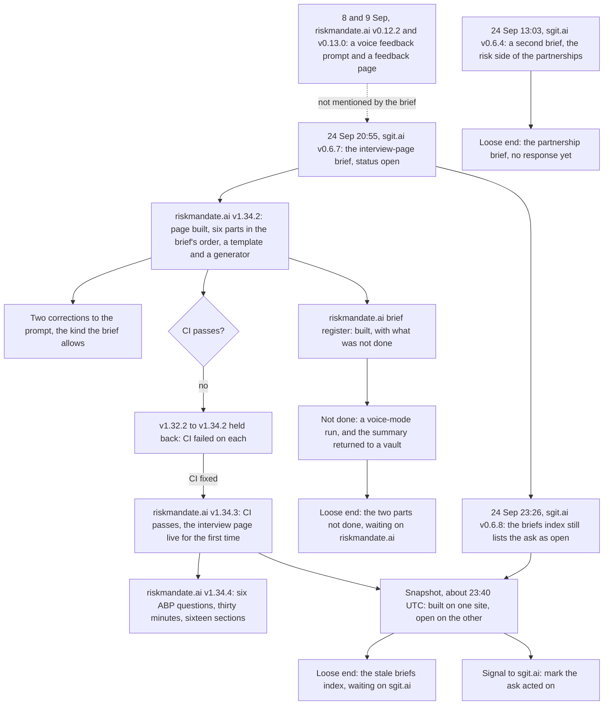

On 24 September 2026 sgit.ai wrote a brief asking riskmandate.ai for an interview page, and riskmandate.ai built it under the same date. The story is told in [A brief written on one site, built on another the same day](nr:stories/2026-09-24__brief-to-build-in-a-day). This map draws the same loop as a flow, with the branch where the build was held back, the parts still waiting, and the index that still says open.

Times are given where a source gives them. sgit.ai's git log times its releases; riskmandate.ai's notes give dates only. So the map can say the brief came at 20:55 and the index was last released at 23:26, but it cannot say at what time riskmandate.ai built or released the page.

## Where each step comes from

| Step | Source |
|---|---|
| The brief, at 20:55 as sgit.ai v0.6.7, "Status: open" | [git log](src:history/sgit.ai-git-log.txt), [the brief](https://sgit.ai/docs/briefs/riskmandate-interview-page-and-voice-prompt.html) |
| The second brief, at 13:03 as v0.6.4 | [git log](src:history/sgit.ai-git-log.txt), [version log](src:history/sgit.ai-version-log.json) |
| Built: "The page has the brief's six parts in its order", "The pattern is a template", the next page "is one JSON file and one command" | [v1.34.2](https://riskmandate.ai/versions/1.34.2.md) |
| The two corrections to the prompt, recorded beside it | [v1.34.2](https://riskmandate.ai/versions/1.34.2.md) |
| Held back: "v1.32.2 to v1.34.2 were merged but never reached the live site", because CI failed on every one | [v1.34.3](https://riskmandate.ai/versions/1.34.3.md) |
| Live: "the interview page reach riskmandate.ai for the first time" | [v1.34.3](https://riskmandate.ai/versions/1.34.3.md) |
| Extended: six questions on the ABP, thirty minutes, sixteen summary sections | [v1.34.4](https://riskmandate.ai/versions/1.34.4.md), [brief register](https://riskmandate.ai/briefs.md) |
| Not done: "This site's agent has no ChatGPT account"; the vault return is marked later | [v1.34.2](https://riskmandate.ai/versions/1.34.2.md), [brief register](https://riskmandate.ai/briefs.md) |
| The index at v0.6.8, 23:26, with the ask "open" | [git log](src:history/sgit.ai-git-log.txt), [briefs index](https://sgit.ai/docs/briefs/index.html) |
| The snapshot time, about 23:40 UTC | [the signal](nr:signals/2026-09-24__interview-page-built-brief-still-open) |
| The earlier feedback prompt and page, not mentioned by the brief | [v0.12.2](https://riskmandate.ai/versions/0.12.2.md), [the Developer's signal](nr:signals/2026-09-24__voice-feedback-interview-came-first) |
| The three loose ends | [loose ends](nr:loose-ends) |

The arrow from the build to the snapshot is drawn from v1.34.3, not v1.34.2, because v1.34.3 is the release that reached the live site. Which of v1.34.3 and sgit.ai's v0.6.8 came first on the day, no source says.
