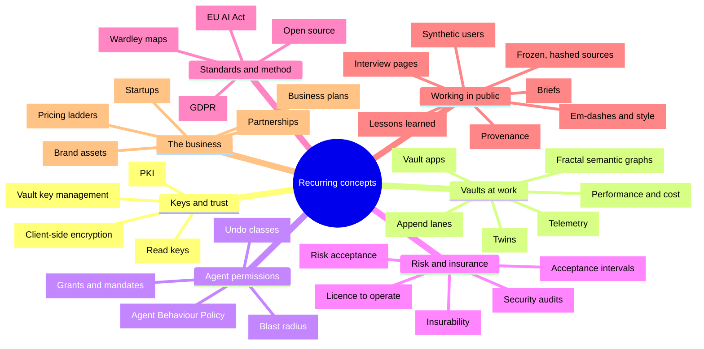
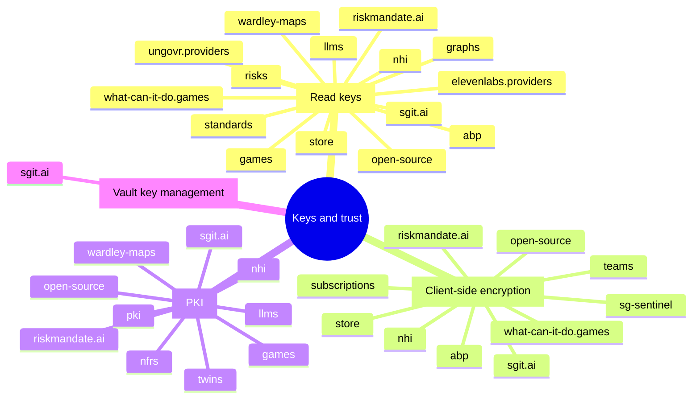
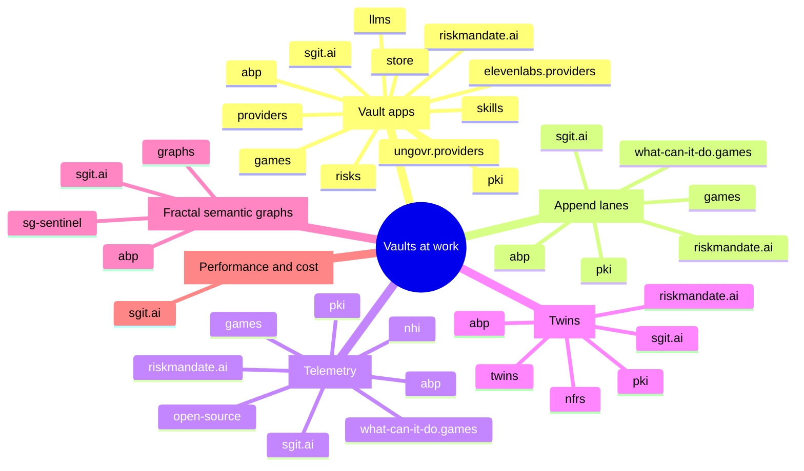
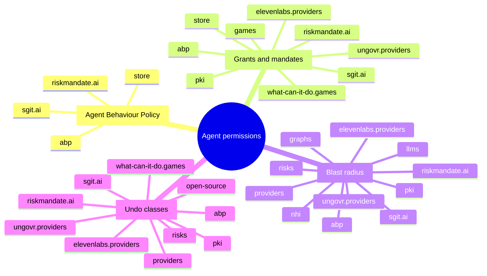
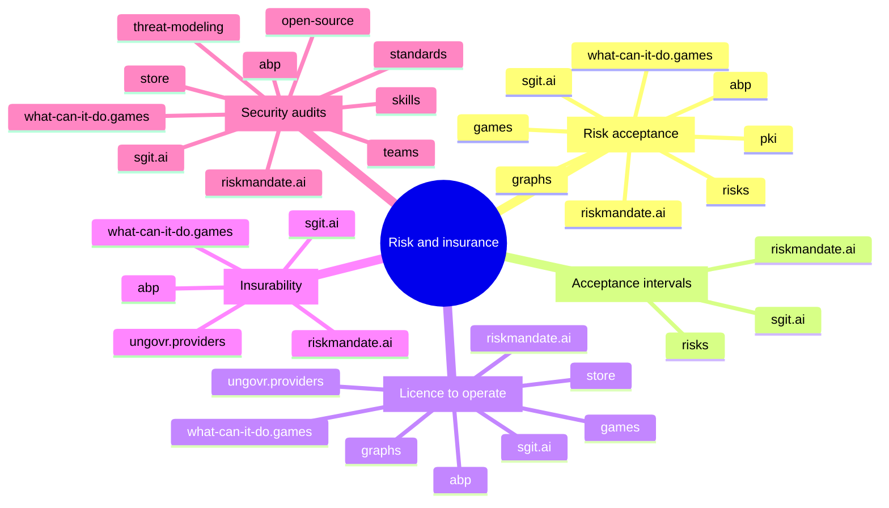
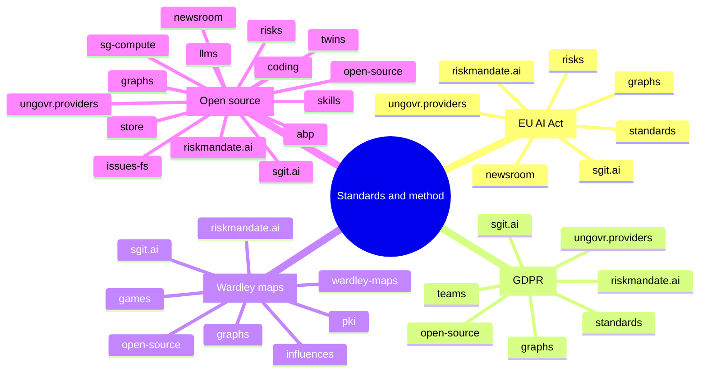
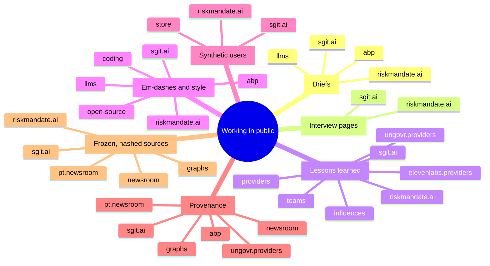
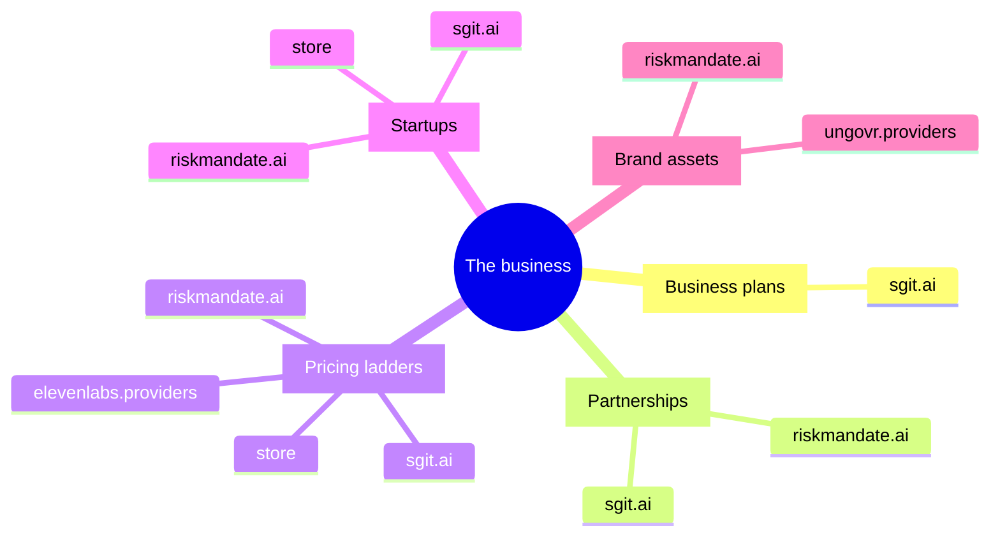

The Librarian keeps a list of concepts that recur across the network, each with a definition, the page where it is defined, and the terms that signal it (`data/concepts.json`). The build searches every snapshotted page for those terms and lists, per concept, the pages and sites that use it: that list is on [the concepts page](nr:concepts), with every page linked. These mindmaps draw that list.

Two parts of this map are the Cartographer's and can be argued with. **The seven themes** are a grouping made for this map: no source groups the concepts this way. **The site lists** are what the build found on 25 September 2026: a site is under a concept when at least one of its snapshotted pages matches the concept's terms. A mention counts the same as a definition, so a site on a leaf uses the word; it does not necessarily build the thing. The concept pages give the counts, which change with every build, so the maps do not repeat them.

Site names ending in `.sgit.ai` are shortened: `abp` is abp.sgit.ai, `llms` is llms.sgit.ai, and so on. `sgit.ai` and `riskmandate.ai` keep their full names.

## The seven themes

### Keys and trust

### Vaults at work

### Agent permissions

### Risk and insurance

### Standards and method

### Working in public

### The business

## What the maps show

- **Three concepts are on one site only**: vault key management, business plans, and performance and cost are found only on sgit.ai ([the concepts page](nr:concepts)). They are sgit.ai's call, plans and measurements, not yet the network's vocabulary.
- **The permission vocabulary travels furthest from where it started.** Grants and mandates and blast radius are defined on riskmandate.ai ([grant gap](https://riskmandate.ai/grant-gap.md)), undo classes on abp.sgit.ai ([undo](https://abp.sgit.ai/model/undo/index.md)), and between them they reach the two games sites, the provider sites and nhi.sgit.ai.
- **Read keys and open source are on the most sites.** A read key is how a published vault is opened ([credentials](https://sgit.ai/docs/credentials.md)), so the concept follows the vaults from site to site.

Where a concept is defined is on [the concepts page](nr:concepts). How the sites link to each other, whatever the concept, is the [network map](nr:maps/network).
