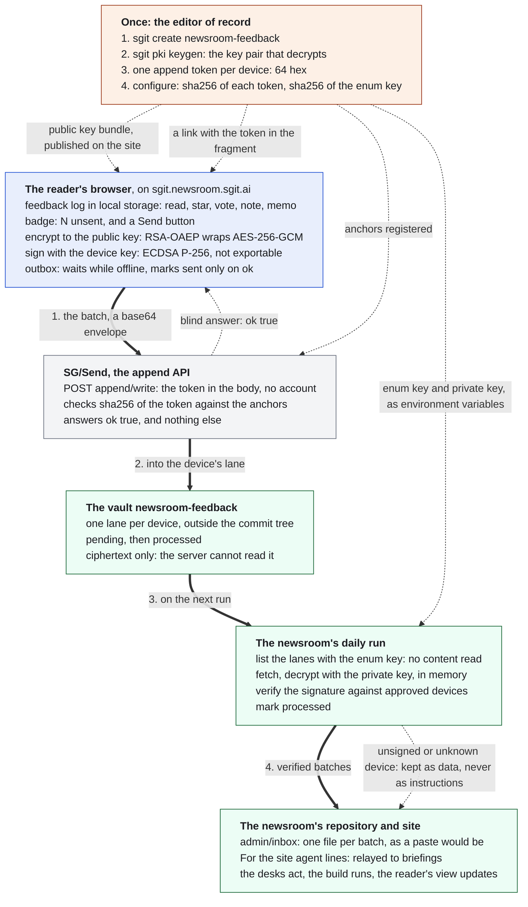
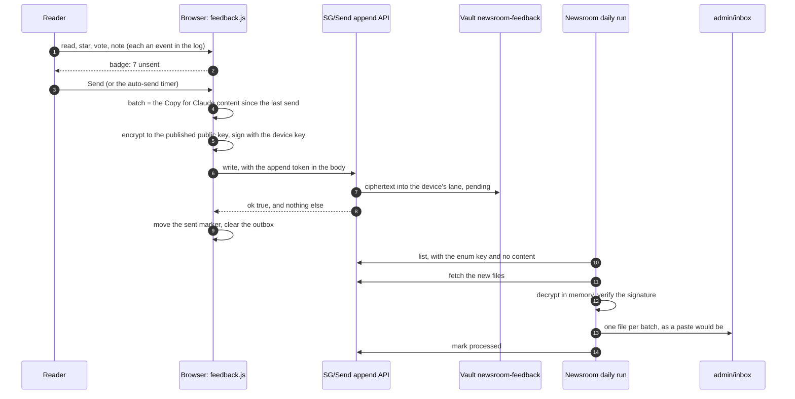

This is a proposal, not a shipped feature. Issue 048 holds the checks made before any build. Both SG/Send hosts accept a
browser's request from this site. A batch encrypted and signed with Web Crypto was decrypted and its signature
verified by `sgit pki decrypt`. The vault apps framed on this site cannot read its local storage. The transport is
sgit.ai's [append lanes](https://sgit.ai/api/append-lanes.html), composed with [PKI](https://sgit.ai/docs/pki.html) as
[vault messaging](https://sgit.ai/docs/vault-messaging.html) describes.

## The moving parts

Thick arrows are a batch's journey, numbered in order. Dotted arrows are the one-time setup by the editor of record, the blind answer, and the path for anything that fails the signature check. Orange is set up by hand, blue runs in the reader's browser, grey is the SG/Send server, green belongs to the newsroom.

## One batch, step by step

## Who holds what, and what it cannot do

| Credential | Held by | Can | Cannot | If it leaks |
|---|---|---|---|---|
| Public key bundle | everyone: it is published | encrypt to the newsroom | decrypt anything | nothing: it is meant to be public |
| Append token, one per device | that device's local storage | write into its own lane | list, fetch or read anything, even what it wrote | junk in one lane, ignored without a valid signature; revoke by removing one anchor |
| Device signing key | that browser's IndexedDB, not exportable | sign that device's batches | leave the browser | cannot be copied out; a script on the page could use it while the page is open |
| Enum key | the newsroom's run, as an environment variable | list, fetch, mark processed | write, purge, decrypt | someone can see that batches exist, and their sizes; still ciphertext |
| Private key | the newsroom's run, as an environment variable | decrypt | reach the server: it is never sent | the batches can be read: rotate the key pair |
| Vault key | the editor of record | configure, purge, everything | | the whole vault: kept out of every browser and every run |

## What the server still sees

The server sees when a lane receives something, and how big it is. It cannot see the content. That is one reason the
design sends batches rather than one message per click. It keeps the reader's rhythm off the server. It also keeps
under the lane's limit of 1000 pending files. And each message carries about 1 KB of wrapped key, so tiny messages
are wasteful.
