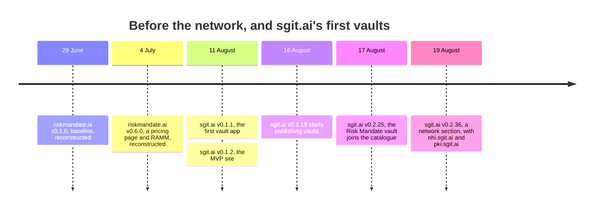
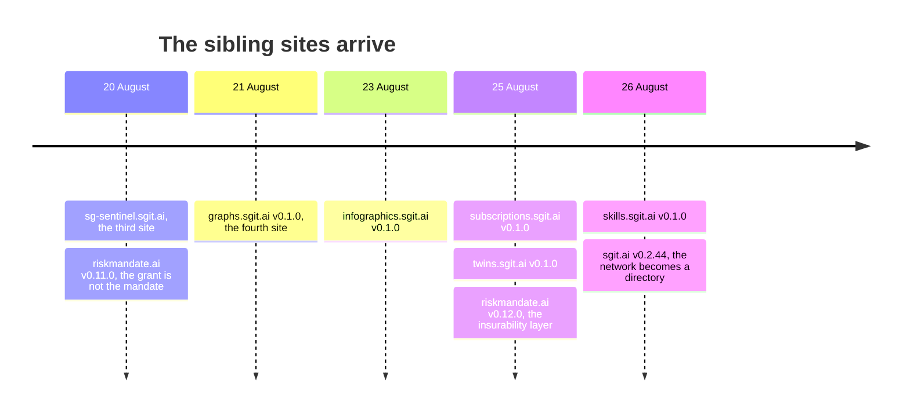
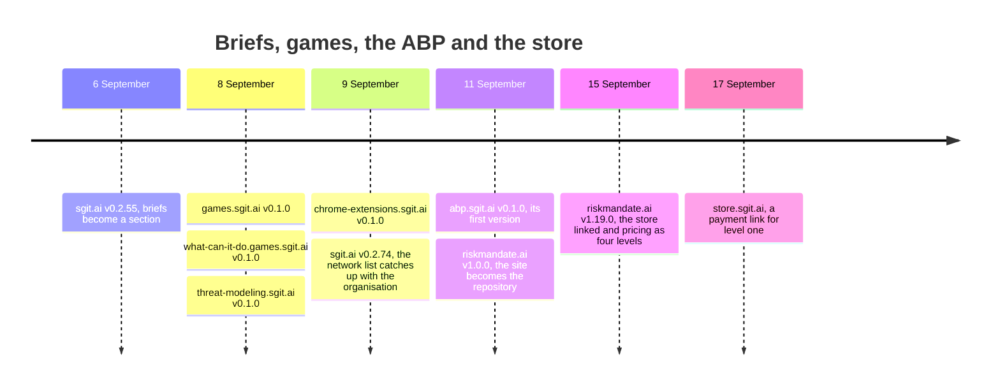
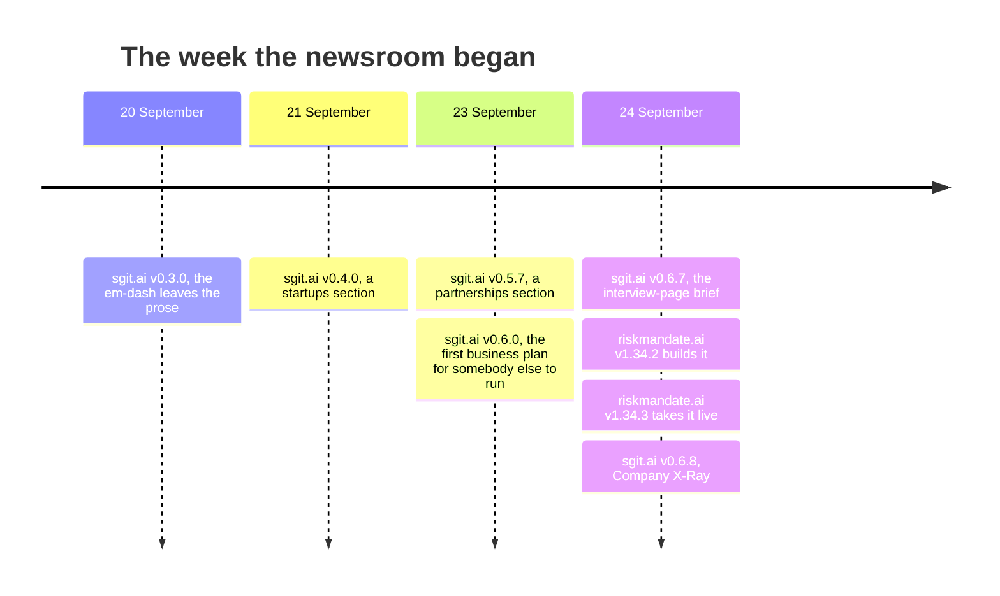

This timeline puts the network's dated events in one line: the sites as they first appeared, and the releases that changed what the network is. The dates come from three kinds of record: sgit.ai's [version log](src:history/sgit.ai-version-log.json) and [git log](src:history/sgit.ai-git-log.txt), riskmandate.ai's [version record](https://riskmandate.ai/versions.md), and the first version each sibling site states about itself.

Two cautions. riskmandate.ai's releases before v1.0.0 are marked "reconstructed" in its record: their notes are a record, and the builds they describe are not in its repository ([version record](https://riskmandate.ai/versions.md)). And a sibling site's "v0.1.0" date is the date the site gives for its first version, not a date we saw it go live. Sites that give no first date (nhi.sgit.ai, pki.sgit.ai and several more) appear only where sgit.ai's log dates them.

### June to 19 August: before the network, and the first vaults

### 20 to 26 August: the sibling sites arrive

### 6 to 17 September: briefs, games, the ABP and the store

### 20 to 24 September: the week the newsroom began

## Where each date comes from

| Date | Event | Source |
|---|---|---|
| 29 June, 4 July | riskmandate.ai v0.1.0 "Baseline"; v0.6.0 "new Pricing page; new RAMM page" | [version record](https://riskmandate.ai/versions.md), both marked reconstructed |
| 11 August | sgit.ai v0.1.1 "Initial vault app"; v0.1.2 "the sgit.ai MVP site" | [version log](src:history/sgit.ai-version-log.json) |
| 16 August | v0.2.19: "The site starts doing the thing it was building toward: publishing vaults" | [version log](src:history/sgit.ai-version-log.json) |
| 17 August | v0.2.25: "Risk Mandate joins the catalogue" | [version log](src:history/sgit.ai-version-log.json) |
| 19 August | v0.2.36: "A NETWORK section for the sibling *.sgit.ai sites", covering nhi.sgit.ai and pki.sgit.ai | [version log](src:history/sgit.ai-version-log.json) |
| 20 August | v0.2.38: "Third site in the network: SG-SENTINEL.SGIT.AI"; riskmandate.ai v0.11.0 "New homepage: the grant is not the mandate" (reconstructed) | [version log](src:history/sgit.ai-version-log.json), [version record](https://riskmandate.ai/versions.md) |
| 21 August | v0.2.39: "Fourth site in the network: GRAPHS.SGIT.AI"; graphs.sgit.ai's own record starts at "v0.1.0 (21 August 2026)" | [version log](src:history/sgit.ai-version-log.json), [graphs.sgit.ai](https://graphs.sgit.ai/llms.txt) |
| 23 to 26 August | infographics.sgit.ai (23 August), subscriptions.sgit.ai and twins.sgit.ai (25 August), skills.sgit.ai (26 August), each at v0.1.0 | [infographics](https://infographics.sgit.ai/llms.txt), [subscriptions](https://subscriptions.sgit.ai/llms.txt), [twins](https://twins.sgit.ai/llms.txt), [skills](https://skills.sgit.ai/llms.txt) |
| 25 August | riskmandate.ai v0.12.0 "New homepage: the insurability layer" (reconstructed) | [version record](https://riskmandate.ai/versions.md) |
| 26 August | v0.2.44: "THE NETWORK BECOMES A DIRECTORY" | [version log](src:history/sgit.ai-version-log.json) |
| 6 September | v0.2.55: "BRIEFS BECOMES A SECTION WITH TWO KINDS IN IT" | [version log](src:history/sgit.ai-version-log.json) |
| 8 and 9 September | games.sgit.ai and what-can-it-do.games.sgit.ai "First publish" (8 September), threat-modeling.sgit.ai v0.1.0 (8 September), chrome-extensions.sgit.ai v0.1.0 (9 September) | [games](https://games.sgit.ai/llms.txt), [what-can-it-do](https://what-can-it-do.games.sgit.ai/llms.txt), [threat-modeling](https://threat-modeling.sgit.ai/llms.txt), [chrome-extensions](https://chrome-extensions.sgit.ai/llms.txt) |
| 9 September | v0.2.74: "THE NETWORK LIST WAS EIGHT SITES BEHIND", checked against the organisation's repositories | [version log](src:history/sgit.ai-version-log.json) |
| 11 September | abp.sgit.ai v0.1.0, "The first version of abp.sgit.ai"; riskmandate.ai v1.0.0 "The site becomes the repository" | [abp.sgit.ai v0.1.0](src:sites/abp.sgit.ai/versions/v0.1.0.json), [version record](https://riskmandate.ai/versions.md) |
| 15 September | riskmandate.ai v1.19.0 "View a policy, buy a policy: the store linked, pricing as the four levels" | [version record](https://riskmandate.ai/versions.md) |
| 17 September | "Level one carries a payment link, created on 17 September 2026" | [store ledger](src:sites/store.sgit.ai/ledger/index.md) |
| 20 September | v0.3.0: "THE EM-DASH IS GONE FROM PROSE" | [version log](src:history/sgit.ai-version-log.json) |
| 21 September | v0.4.0: "A STARTUPS SECTION" | [version log](src:history/sgit.ai-version-log.json) |
| 23 September | v0.5.7: "NEW SECTION: PARTNERSHIPS"; v0.6.0: "THE FIRST BUSINESS PLAN PUBLISHED FOR SOMEBODY ELSE TO RUN" | [version log](src:history/sgit.ai-version-log.json) |
| 24 September | sgit.ai v0.6.7 at 20:55 and v0.6.8 at 23:26 ([git log](src:history/sgit.ai-git-log.txt)); riskmandate.ai v1.34.2 and v1.34.3, dated but not timed | [version record](https://riskmandate.ai/versions.md); the day is drawn in [brief to build](nr:maps/brief-to-build) |

store.sgit.ai, newsroom.sgit.ai and the other sites in the snapshot state a current version but, in the files we hold, no first date, so they are not on the line. The [network map](nr:maps/network) shows them all by their links.
