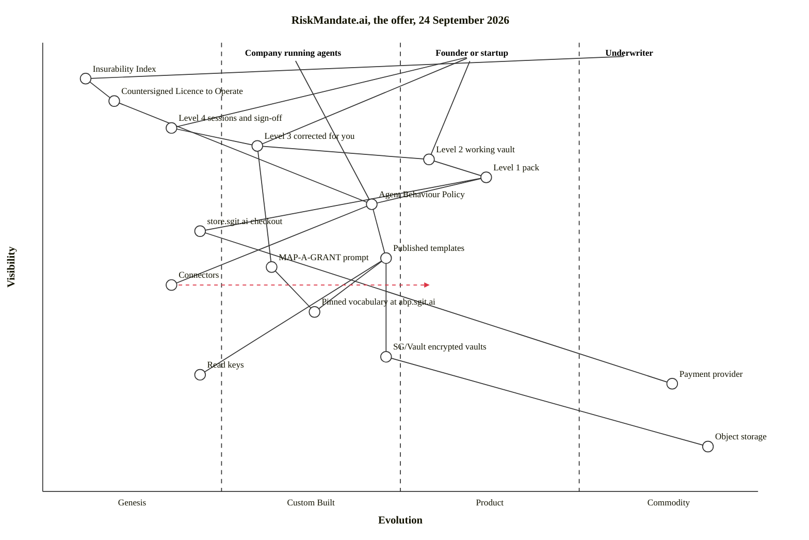

This map shows riskmandate.ai's offer as its own pages describe it in the snapshot of 24 September 2026 (site v1.34.8). At the top are the buyers the site addresses. Under them are the four paid levels, then the one document every level delivers, then what that document is made from, and at the bottom what riskmandate.ai reuses from the rest of the sgit network: the store, sgit.ai's encrypted vaults and read keys, and the vocabulary pinned at abp.sgit.ai.

As with every map here, a position is a claim ([wardley-maps.sgit.ai](https://wardley-maps.sgit.ai/llms.txt)). The rule: what the site calls a design, or "specified, never run", is genesis; what it says "exists and runs" and carries a price is product; the payment rail and storage underneath are commodity.

## Where each position comes from

| Component | Evolution | Why there, and the source |
|---|---|---|
| Company running agents | anchor | "You run agents today" ([for corporate](https://riskmandate.ai/for-corporate.md)). |
| Founder or startup | anchor | "You are a founder" ([for founders](https://riskmandate.ai/for-founders.md)); the store says its startup group is "a framing of tiers 3, 4 and 2" ([store ledger](src:sites/store.sgit.ai/ledger/index.md)), which gives the three links from this anchor. |
| Underwriter | anchor | "The record an underwriter will accept" is the step after the behaviour policy ([Licence to Operate](https://riskmandate.ai/licence-to-operate.md)); the way back to cover "is evidence an underwriter will accept" ([llms.txt](https://riskmandate.ai/llms.txt)). |
| Insurability Index | genesis (0.06) | "the published design for how that evidence is scored" ([insurance](https://riskmandate.ai/insurance.md)). A design, not a product. |
| Countersigned Licence to Operate | genesis (0.10) | The licence file ships "as a **template**: unsigned, unissued"; the countersigned form is "what we have not built" ([Licence to Operate](https://riskmandate.ai/licence-to-operate.md)). The same page: "A licence needs a behaviour policy underneath it". |
| Level 4, two sessions and sign-off (£1,500) | genesis to custom (0.18) | "a person", "specified, never run" ([pricing](https://riskmandate.ai/pricing.md)). |
| Level 3, corrected for you (£500) | custom (0.30) | "agents, a person reviews", "specified, never run" ([pricing](https://riskmandate.ai/pricing.md)). The store's ledger reads differently: "that work has been done many times" ([store ledger](src:sites/store.sgit.ai/ledger/index.md)). The map follows riskmandate.ai's own page; the disagreement is the store's to settle with it. |
| Level 2, a working vault (£50) | product (0.54) | "automated", "exists and runs" ([pricing](https://riskmandate.ai/pricing.md)); "Built, and it runs today" ([store ledger](src:sites/store.sgit.ai/ledger/index.md)). |
| Level 1, the pack (£10) | product (0.62) | "automated", "exists and runs" ([pricing](https://riskmandate.ai/pricing.md)), and the only level with a payment link, "created on 17 September 2026" ([store ledger](src:sites/store.sgit.ai/ledger/index.md)). |
| Agent Behaviour Policy | custom to product (0.46) | "Every level is the same document" ([pricing](https://riskmandate.ai/pricing.md)); "From £10 for one agent" ([home](https://riskmandate.ai/index.md)). Placed below the two automated levels because two of its four forms have not run. |
| store.sgit.ai checkout | custom, early (0.22) | The store "owns e-commerce, riskmandate.ai owns the products and the policies" ([store llms.txt](https://store.sgit.ai/llms.txt)); "No rail exists yet" ([store ledger](src:sites/store.sgit.ai/ledger/index.md)). |
| Published templates | custom (0.48) | Free examples with published read keys; "Built, and it runs today" ([store ledger](src:sites/store.sgit.ai/ledger/index.md)). |
| MAP-A-GRANT prompt | custom (0.32) | Public, travels "in every vault as `MAP-A-GRANT.md`", and is the level-three step ([pricing](https://riskmandate.ai/pricing.md)). |
| Connectors | genesis, evolving | "connectors are built per engagement ... then productised as they mature" ([how it works](https://riskmandate.ai/how-it-works.md)). That sentence is the one stated direction on this map, so it is the one `evolve` arrow. |
| Pinned vocabulary at abp.sgit.ai | custom (0.38) | "the vocabulary is pinned at abp.sgit.ai and sixteen published vaults are built against it" ([home](https://riskmandate.ai/index.md)); the prompt works "in the fixed vocabulary of 23 capabilities and four barriers" ([pricing](https://riskmandate.ai/pricing.md)). |
| SG/Vault encrypted vaults | custom to product (0.48) | "It is built on SG/Vault" ([llms.txt](https://riskmandate.ai/llms.txt)). Same position as on [the network map](nr:maps/sgit-network-wardley). |
| Read keys | genesis to custom (0.22) | The templates are "read live in the browser from the encrypted vault with a published read key" ([llms.txt](https://riskmandate.ai/llms.txt)); sgit.ai calls the read key "one novel component" ([map 3](https://sgit.ai/demos/sgit-maps.html)). |
| Payment provider | commodity (0.88) | "the paying happens on the payment provider's own pages" ([pricing](https://riskmandate.ai/pricing.md)). |
| Object storage | commodity (0.93) | Under every vault; see [the network map](nr:maps/sgit-network-wardley). |

## What riskmandate.ai reuses from sgit.ai, in one list

- The vault format and its host: every policy "lives in an encrypted vault you hold the keys to" ([how it works](https://riskmandate.ai/how-it-works.md)).
- Read keys, for the free templates ([llms.txt](https://riskmandate.ai/llms.txt)).
- The store, for the order and the payment link ([store llms.txt](https://store.sgit.ai/llms.txt)).
- The vocabulary pinned at abp.sgit.ai ([home](https://riskmandate.ai/index.md)).
- nhi.sgit.ai's phrase "hope is not a control", quoted as the reason a prompt is not a control ([how it works](https://riskmandate.ai/how-it-works.md)).

The reuse also runs the other way: sgit.ai's Company X-Ray plan reuses riskmandate.ai's pricing pattern (v0.6.8, [version log](src:history/sgit.ai-version-log.json)).
