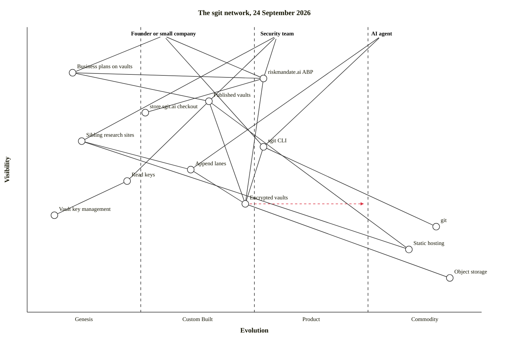

This map shows the sgit network as a chain of needs, as of the snapshot of 24 September 2026. The top row is the users the sites name. Below them are what those users touch (products, published vaults, business plans), then the parts those depend on, down to the storage underneath. Left to right is evolution: genesis, custom-built, product, commodity.

A placement on the evolution axis is a claim, not a finding. [wardley-maps.sgit.ai](https://wardley-maps.sgit.ai/llms.txt) warns that a model placing components "is generating consensus-shaped output with no underlying evidence" and asks that every placement be surfaced "as an explicitly contestable claim requiring human challenge". So each position below names the page it comes from, and the rule used was the newsroom's: a proposal or a design is genesis or custom, something with a price is product, object storage is commodity. Where a source gives no evolution signal, the component sits in the middle of the stage its source describes, and the table says so.

## Where each position comes from

| Component | Evolution | Why there, and the source |
|---|---|---|
| Founder or small company | anchor | sgit.ai's [startups section](https://sgit.ai/startups/index.html) is written "for founders building on vaults". |
| Security team | anchor | [Findings about your own weaknesses](https://sgit.ai/use-cases/security-teams.html), one of the situations on sgit.ai's use-case pages. |
| AI agent | anchor | [Agent state that isn't the vendor's to read](https://sgit.ai/use-cases/ai-agents.html); the home page calls sgit "Git for encrypted vaults, for humans and AI agents" ([home](https://sgit.ai/index.html)). |
| Business plans on vaults | genesis (0.10) | Plans "published for somebody else to run" (sgit.ai v0.6.0), and Company X-Ray's four levels "reuse RiskMandate.ai's pricing pattern" (v0.6.8), both in the [version log](src:history/sgit.ai-version-log.json); listed at [business plans](https://sgit.ai/startups/business-plans.html). A plan for someone else is a proposal. |
| riskmandate.ai ABP | product, low (0.52) | Four levels with a price each, £10 to £1,500 ([pricing](https://riskmandate.ai/pricing.md)). Kept at the lower edge of product because the same page says "two of the four have never been sold once". Built "on SG/Vault" ([llms.txt](https://riskmandate.ai/llms.txt)). Its offer has [its own map](nr:maps/riskmandate-wardley). |
| Published vaults | custom (0.40) | Each is built and published one by one, with a read key printed on its page ([home](https://sgit.ai/index.html)); the pentest report vault is the security team's case ("Hand over a report"). |
| store.sgit.ai checkout | custom, early (0.26) | The store sells the four levels, but "No rail exists yet", and "One of the four levels can be paid for" ([store ledger](src:sites/store.sgit.ai/ledger/index.md)). |
| Sibling research sites | genesis (0.12) | nhi.sgit.ai, pki.sgit.ai, graphs.sgit.ai and the rest publish arguments and designs; pki.sgit.ai "publishes four rules BEFORE the registry exists" (v0.2.36, [version log](src:history/sgit.ai-version-log.json)). The same note says pki.sgit.ai's rule "is append lanes, already shipped". Sibling sites are served by GitHub Pages (v0.2.44). |
| sgit CLI | custom to product (0.52) | `pip install sgit-ai`, "Pure Python · two runtime dependencies · Apache-2.0" ([home](https://sgit.ai/index.html)); "Beta status (in production use)" since v0.1.3. The same verbs as git ([startups](https://sgit.ai/startups/index.html)). |
| Append lanes | custom (0.36) | Shipped; an agent built a vault on them the same day the brief appeared (v0.2.56, [version log](src:history/sgit.ai-version-log.json)). sgit.ai's own maps place the write-scoped token on the agents' map ([sgit on a Wardley map](https://sgit.ai/demos/sgit-maps.html), map 5). |
| Read keys | genesis to custom (0.22) | sgit.ai's own map calls the publishable read key "one novel component" ([sgit on a Wardley map](https://sgit.ai/demos/sgit-maps.html), map 3). |
| Encrypted vaults | custom to product (0.48), evolving | The one stated direction on this map: sgit.ai's map 6, "The strategy: commoditise private version control" ([sgit on a Wardley map](https://sgit.ai/demos/sgit-maps.html)). The arrow is that stated intent, not a measured movement. |
| Vault key management | genesis (0.06) | "We are looking for a key manager, not building one"; today the keys "travel by copy and paste" ([call for collaboration](https://sgit.ai/partnerships/vault-key-management.html)). |
| git | commodity (0.90) | sgit.ai's map 1 draws "git at full strength: a commodity" ([sgit on a Wardley map](https://sgit.ai/demos/sgit-maps.html)). |
| Static hosting | commodity (0.84) | A vault "also runs from a plain static host or a bucket" ([startups](https://sgit.ai/startups/index.html)). |
| Object storage | commodity (0.93) | "The store is encrypted files in cloud storage, read directly", billed as "storage and egress only" ([startups](https://sgit.ai/startups/index.html)). |

## Where each link comes from

- Founder to business plans, the ABP and the CLI: the [business plans](https://sgit.ai/startups/business-plans.html) are "for founders"; riskmandate.ai has a page "You are a founder" ([llms.txt](https://riskmandate.ai/llms.txt)); step one of the founder's ladder is "`pip install sgit-ai`, create, commit, push" ([startups](https://sgit.ai/startups/index.html)).
- Security team to published vaults, the ABP and the sibling sites: the pentest report vault ([home](https://sgit.ai/index.html)); riskmandate.ai's record is one "the CEO, CTO and CISO can all stand behind" ([riskmandate.ai](https://riskmandate.ai/index.md)); the network directory groups sibling sites under "Risk & governance" and "Security & infrastructure" (v0.2.44, [version log](src:history/sgit.ai-version-log.json)).
- AI agent to the CLI and append lanes: `sgit write ... --push --json` on the [home page](https://sgit.ai/index.html), and the write-scoped token on sgit.ai's agents map ([map 5](https://sgit.ai/demos/sgit-maps.html)).
- Business plans to the ABP: Company X-Ray reuses riskmandate.ai's pricing pattern (v0.6.8). The ABP to the store: the Buy buttons on [pricing](https://riskmandate.ai/pricing.md) go to store.sgit.ai. The ABP to vaults: "built on SG/Vault" ([llms.txt](https://riskmandate.ai/llms.txt)).
- Read keys to key management: the [call for collaboration](https://sgit.ai/partnerships/vault-key-management.html) names the key as "the whole access control".

## What the map leaves out, and why

- **The vault server's API.** sgit.ai says "the API is a convenience over the store, not a requirement of it" (v0.3.6, [version log](src:history/sgit.ai-version-log.json)), so the vaults link straight to object storage.
- **Every sibling site by name.** They sit in one component; the [network map](nr:maps/network) draws which site links to which, computed from the snapshot.
- **Movement nobody stated.** Only one `evolve` arrow is drawn, because only one source states a direction for a component on this map.
