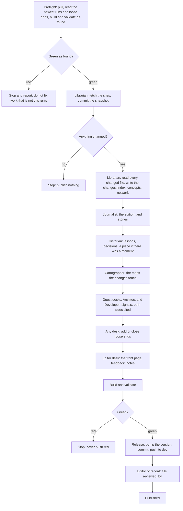
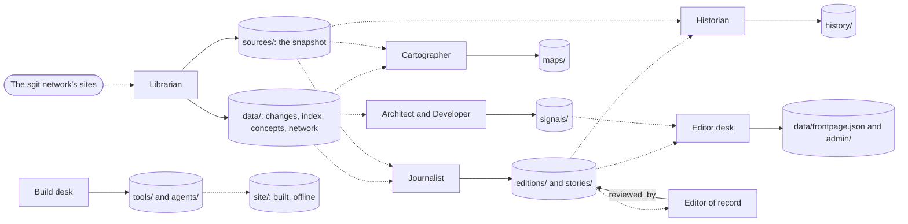

The newsroom's desks are defined in one register, `data/agents.json`, rendered as [the newsroom page](nr:newsroom), with one page per desk. The order of a day is written in [the daily run](nr:brief/05-daily-run) and in the run skill that follows it step by step. These two flowcharts draw both, so a reader can see where the work goes and where it can stop.

## The daily run, and its gates

Every desk step ends with a run record in `runs/` ([run records](nr:newsroom/runs)). The run stops in four places: when the tree it finds is red at preflight, when nothing changed on any site ("stop here and publish nothing"), when the build or the validator is red at the end ("Never push red"), and at the editor of record, because nothing is called published until `reviewed_by` is filled.

The order and the stops are from [the daily run](nr:brief/05-daily-run) and the run skill, steps 1 to 10. The Cartographer's own check sits inside its step: every map is opened in a browser, offline, because "a Mermaid syntax error renders as an error box, not a map" ([the Cartographer](nr:newsroom/agents/cartographer.desk)).

## Who reads and writes what

Solid arrows are writes, dotted arrows are reads. The folders are the ones each desk's mandate names; `tools/validate.py` fails a run record that claims a folder outside them ([run records](nr:newsroom/runs)). Every desk may also write `runs/`, `site/`, `version.txt` and `data/loose-ends.json`; those shared writes are left off to keep the chart readable.

What each arrow rests on, from the register as [the newsroom page](nr:newsroom) renders it:

- **Librarian** reads today's snapshot and the last committed manifest; writes `sources/` and the data files (changes, index, concepts, vaults, network).
- **Journalist** reads the Librarian's changes file and the sources; writes `editions/` and `stories/`.
- **Historian** reads `editions/`, the changes and the version records; writes `history/`.
- **Cartographer** reads the index, the concepts and the network, and the sources behind every component; writes `maps/`.
- **Architect and Developer** (guest desks) read the day's changes against the index and concepts; write `signals/`.
- **Editor desk** reads everything the desks wrote, and the run records; writes the front page, the sections and `admin/`.
- **Build desk** writes the tools, the agents' pages and the build; `tools/build.py` turns every folder above into `site/`.
- **Editor of record** reads every edition, story, history piece and signal, and is the only one who fills `reviewed_by`.

The chart shows one arrow from the Editor of record for all reviewed pieces; the register lists history, signals and maps as well.
