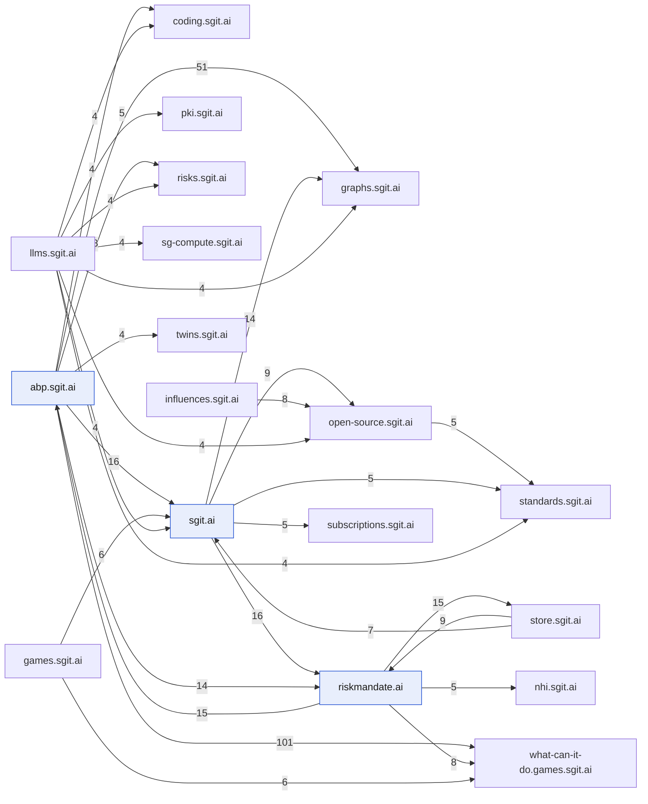

# The network

```mermaid
flowchart LR
  n_abp_sgit_ai["abp.sgit.ai"]
  n_coding_sgit_ai["coding.sgit.ai"]
  n_games_sgit_ai["games.sgit.ai"]
  n_graphs_sgit_ai["graphs.sgit.ai"]
  n_influences_sgit_ai["influences.sgit.ai"]
  n_llms_sgit_ai["llms.sgit.ai"]
  n_nhi_sgit_ai["nhi.sgit.ai"]
  n_open_source_sgit_ai["open-source.sgit.ai"]
  n_pki_sgit_ai["pki.sgit.ai"]
  n_riskmandate_ai["riskmandate.ai"]
  n_risks_sgit_ai["risks.sgit.ai"]
  n_sg_compute_sgit_ai["sg-compute.sgit.ai"]
  n_sgit_ai["sgit.ai"]
  n_standards_sgit_ai["standards.sgit.ai"]
  n_store_sgit_ai["store.sgit.ai"]
  n_subscriptions_sgit_ai["subscriptions.sgit.ai"]
  n_twins_sgit_ai["twins.sgit.ai"]
  n_what_can_it_do_games_sgit_ai["what-can-it-do.games.sgit.ai"]
  n_abp_sgit_ai -->|101| n_what_can_it_do_games_sgit_ai
  n_abp_sgit_ai -->|51| n_graphs_sgit_ai
  n_abp_sgit_ai -->|16| n_sgit_ai
  n_sgit_ai -->|16| n_riskmandate_ai
  n_riskmandate_ai -->|15| n_abp_sgit_ai
  n_riskmandate_ai -->|15| n_store_sgit_ai
  n_abp_sgit_ai -->|14| n_riskmandate_ai
  n_sgit_ai -->|14| n_graphs_sgit_ai
  n_sgit_ai -->|9| n_open_source_sgit_ai
  n_store_sgit_ai -->|9| n_riskmandate_ai
  n_abp_sgit_ai -->|8| n_risks_sgit_ai
  n_influences_sgit_ai -->|8| n_open_source_sgit_ai
  n_riskmandate_ai -->|8| n_what_can_it_do_games_sgit_ai
  n_store_sgit_ai -->|7| n_sgit_ai
  n_games_sgit_ai -->|6| n_sgit_ai
  n_games_sgit_ai -->|6| n_what_can_it_do_games_sgit_ai
  n_llms_sgit_ai -->|5| n_pki_sgit_ai
  n_open_source_sgit_ai -->|5| n_standards_sgit_ai
  n_riskmandate_ai -->|5| n_nhi_sgit_ai
  n_sgit_ai -->|5| n_standards_sgit_ai
  n_sgit_ai -->|5| n_subscriptions_sgit_ai
  n_abp_sgit_ai -->|4| n_coding_sgit_ai
  n_abp_sgit_ai -->|4| n_twins_sgit_ai
  n_llms_sgit_ai -->|4| n_coding_sgit_ai
  n_llms_sgit_ai -->|4| n_graphs_sgit_ai
  n_llms_sgit_ai -->|4| n_open_source_sgit_ai
  n_llms_sgit_ai -->|4| n_risks_sgit_ai
  n_llms_sgit_ai -->|4| n_sg_compute_sgit_ai
  n_llms_sgit_ai -->|4| n_sgit_ai
  n_llms_sgit_ai -->|4| n_standards_sgit_ai
  classDef hub fill:#e8eefc,stroke:#1f4fd1,color:#1b1a17
  class n_abp_sgit_ai,n_riskmandate_ai,n_sgit_ai hub
```
