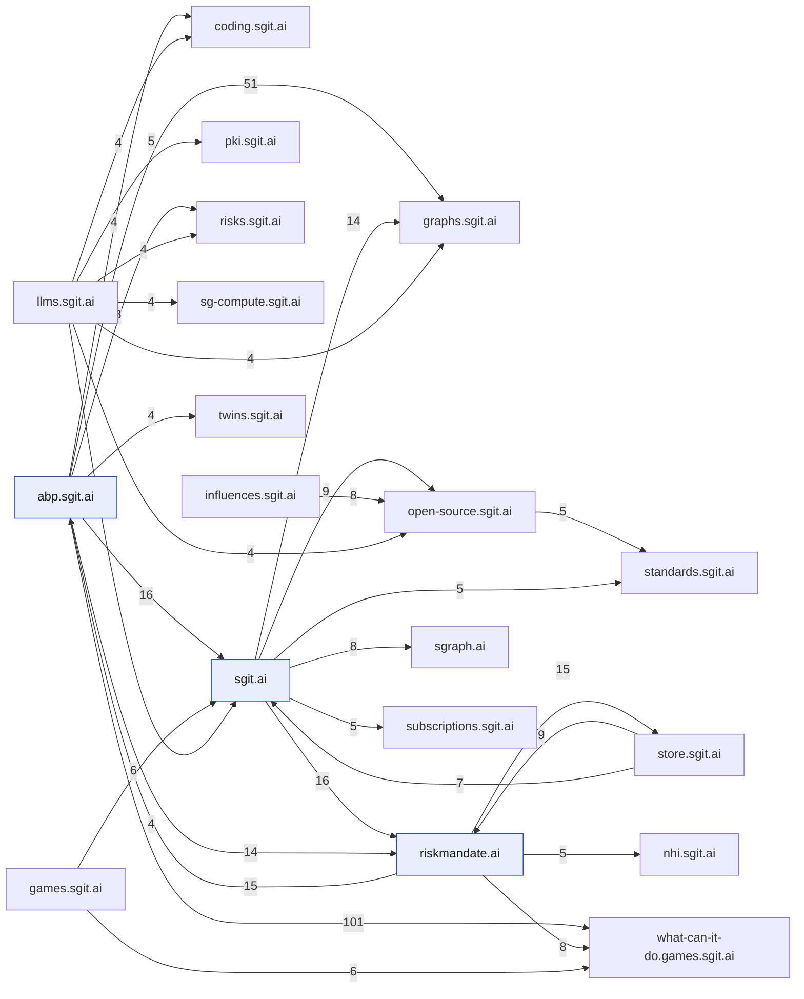

# The network

```mermaid
flowchart LR
  n_abp_sgit_ai["abp.sgit.ai"]
  n_coding_sgit_ai["coding.sgit.ai"]
  n_games_sgit_ai["games.sgit.ai"]
  n_graphs_sgit_ai["graphs.sgit.ai"]
  n_influences_sgit_ai["influences.sgit.ai"]
  n_llms_sgit_ai["llms.sgit.ai"]
  n_nhi_sgit_ai["nhi.sgit.ai"]
  n_open_source_sgit_ai["open-source.sgit.ai"]
  n_pki_sgit_ai["pki.sgit.ai"]
  n_riskmandate_ai["riskmandate.ai"]
  n_risks_sgit_ai["risks.sgit.ai"]
  n_sg_compute_sgit_ai["sg-compute.sgit.ai"]
  n_sgit_ai["sgit.ai"]
  n_sgraph_ai["sgraph.ai"]
  n_standards_sgit_ai["standards.sgit.ai"]
  n_store_sgit_ai["store.sgit.ai"]
  n_subscriptions_sgit_ai["subscriptions.sgit.ai"]
  n_twins_sgit_ai["twins.sgit.ai"]
  n_what_can_it_do_games_sgit_ai["what-can-it-do.games.sgit.ai"]
  n_abp_sgit_ai -->|101| n_what_can_it_do_games_sgit_ai
  n_abp_sgit_ai -->|51| n_graphs_sgit_ai
  n_abp_sgit_ai -->|16| n_sgit_ai
  n_sgit_ai -->|16| n_riskmandate_ai
  n_riskmandate_ai -->|15| n_abp_sgit_ai
  n_riskmandate_ai -->|15| n_store_sgit_ai
  n_abp_sgit_ai -->|14| n_riskmandate_ai
  n_sgit_ai -->|14| n_graphs_sgit_ai
  n_sgit_ai -->|9| n_open_source_sgit_ai
  n_store_sgit_ai -->|9| n_riskmandate_ai
  n_abp_sgit_ai -->|8| n_risks_sgit_ai
  n_influences_sgit_ai -->|8| n_open_source_sgit_ai
  n_riskmandate_ai -->|8| n_what_can_it_do_games_sgit_ai
  n_sgit_ai -->|8| n_sgraph_ai
  n_store_sgit_ai -->|7| n_sgit_ai
  n_games_sgit_ai -->|6| n_sgit_ai
  n_games_sgit_ai -->|6| n_what_can_it_do_games_sgit_ai
  n_llms_sgit_ai -->|5| n_pki_sgit_ai
  n_open_source_sgit_ai -->|5| n_standards_sgit_ai
  n_riskmandate_ai -->|5| n_nhi_sgit_ai
  n_sgit_ai -->|5| n_standards_sgit_ai
  n_sgit_ai -->|5| n_subscriptions_sgit_ai
  n_abp_sgit_ai -->|4| n_coding_sgit_ai
  n_abp_sgit_ai -->|4| n_twins_sgit_ai
  n_llms_sgit_ai -->|4| n_coding_sgit_ai
  n_llms_sgit_ai -->|4| n_graphs_sgit_ai
  n_llms_sgit_ai -->|4| n_open_source_sgit_ai
  n_llms_sgit_ai -->|4| n_risks_sgit_ai
  n_llms_sgit_ai -->|4| n_sg_compute_sgit_ai
  n_llms_sgit_ai -->|4| n_sgit_ai
  click n_abp_sgit_ai "../reading-room/abp.sgit.ai.html" "abp.sgit.ai: every file in the snapshot"
  click n_coding_sgit_ai "../reading-room/coding.sgit.ai.html" "coding.sgit.ai: every file in the snapshot"
  click n_games_sgit_ai "../reading-room/games.sgit.ai.html" "games.sgit.ai: every file in the snapshot"
  click n_graphs_sgit_ai "../reading-room/graphs.sgit.ai.html" "graphs.sgit.ai: every file in the snapshot"
  click n_influences_sgit_ai "../reading-room/influences.sgit.ai.html" "influences.sgit.ai: every file in the snapshot"
  click n_llms_sgit_ai "../reading-room/llms.sgit.ai.html" "llms.sgit.ai: every file in the snapshot"
  click n_nhi_sgit_ai "../reading-room/nhi.sgit.ai.html" "nhi.sgit.ai: every file in the snapshot"
  click n_open_source_sgit_ai "../reading-room/open-source.sgit.ai.html" "open-source.sgit.ai: every file in the snapshot"
  click n_pki_sgit_ai "../reading-room/pki.sgit.ai.html" "pki.sgit.ai: every file in the snapshot"
  click n_riskmandate_ai "../reading-room/riskmandate.ai.html" "riskmandate.ai: every file in the snapshot"
  click n_risks_sgit_ai "../reading-room/risks.sgit.ai.html" "risks.sgit.ai: every file in the snapshot"
  click n_sg_compute_sgit_ai "../reading-room/sg-compute.sgit.ai.html" "sg-compute.sgit.ai: every file in the snapshot"
  click n_sgit_ai "../reading-room/sgit.ai.html" "sgit.ai: every file in the snapshot"
  click n_sgraph_ai "../reading-room/sgraph.ai.html" "sgraph.ai: every file in the snapshot"
  click n_standards_sgit_ai "../reading-room/standards.sgit.ai.html" "standards.sgit.ai: every file in the snapshot"
  click n_store_sgit_ai "../reading-room/store.sgit.ai.html" "store.sgit.ai: every file in the snapshot"
  click n_subscriptions_sgit_ai "../reading-room/subscriptions.sgit.ai.html" "subscriptions.sgit.ai: every file in the snapshot"
  click n_twins_sgit_ai "../reading-room/twins.sgit.ai.html" "twins.sgit.ai: every file in the snapshot"
  click n_what_can_it_do_games_sgit_ai "../reading-room/what-can-it-do.games.sgit.ai.html" "what-can-it-do.games.sgit.ai: every file in the snapshot"
  classDef hub fill:#e8eefc,stroke:#1f4fd1,color:#1b1a17
  class n_abp_sgit_ai,n_riskmandate_ai,n_sgit_ai hub
```
