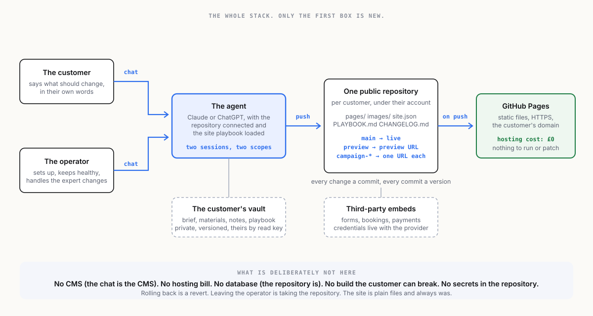

[← The idea](01-the-idea.md) · [Index](00-START-HERE.md) · [Next →](03-the-workflow.md)

# 2 · The architecture



The stack has four parts, and only one of them is new.

## 1. The agent

A Claude or ChatGPT session with the repository connected. In Claude that is a project or a Claude Code session with the GitHub connection; in ChatGPT it is a project with the GitHub connector and code execution. Either is more than powerful enough. The agent carries a short operating document per customer, the **site playbook** (see `prototypes/webmaster-playbook.md`): what the site is, who the customer is, what they are allowed to change directly, what needs the operator, the brand rules, and the change log.

Two sessions exist per customer, and the distinction is the product:

| Session | Who drives it | What it can do |
|---|---|---|
| **The operator's session** | The person running the business | Everything. Setup, structure, design, fixes, anything the customer asks for that is beyond the customer's own session. |
| **The customer's session** | The customer, under the maintenance package | Content changes on the pages they own, within the playbook's rules, pushed to the preview branch or, for small changes, straight to live. |

The customer's session is what makes this different from an agency. The customer can go there and make changes, in plain language, whenever they want. The operator's session is what makes it safe.

## 2. The repository

One public GitHub repository per customer. Public, deliberately: the site is public anyway, so there is nothing in the repository that is not already on the internet, and public repositories get GitHub Pages for free. The repository holds:

```
index.html            or a small static generator's source
pages/                one file per page
images/               the customer's photos, resized
site.json             the structured content the pages are built from
PLAYBOOK.md           the agent's operating instructions for this site
CHANGELOG.md          every change, in plain language, newest first
.github/workflows/    the deploy
```

Static files only. No database, no server-side code, no plugins. If the site needs something dynamic, a booking form, a newsletter sign-up, a payment, it is done with a third-party service embedded in the page, and the credential for it lives with that service, never in the repository.

## 3. The branches

Two, with an optional third:

| Branch | Deploys to | Used for |
|---|---|---|
| `main` | the live domain | what the customer's visitors see |
| `preview` | `preview.<domain>` or the GitHub Pages preview URL | changes the customer wants to look at before they go live |
| `campaign-*` | a preview URL each | a seasonal page, a launch, an experiment, merged or deleted afterwards |

Every change is a commit with a plain-language message. Every commit is a version. Rolling back is a revert. The customer never loses anything, and neither does the operator.

## 4. The deploy

GitHub Pages, from the repository, on every push, via GitHub Actions. Free for public repositories. HTTPS on a custom domain with a DNS record the customer owns. Nothing to run, nothing to patch, nothing to renew except the domain.

## What is not in the stack, on purpose

- **No CMS.** The chat is the CMS.
- **No hosting bill.** GitHub Pages is the host.
- **No database.** The repository is the database, and git is the history.
- **No build the customer can break.** Plain HTML or a generator so simple the agent maintains it.
- **No secrets in the repository.** Anything with a credential is a third-party embed.

## Where vaults come in

The customer's website does not need a vault. It is public, static and on GitHub, and that is the point of it. **The business does.** Every customer has a brief, a brand pack, the notes from the setup call, sometimes a document they would rather not put in a public repository. The operator holds those in a vault per customer, versioned like the site is, openable by the customer with a read key, and handed over whole if the customer ever leaves. The operator's own playbook, pricing and templates are a vault too, and so is this plan.

---

[← The idea](01-the-idea.md) · [Index](00-START-HERE.md) · [Next →](03-the-workflow.md)
