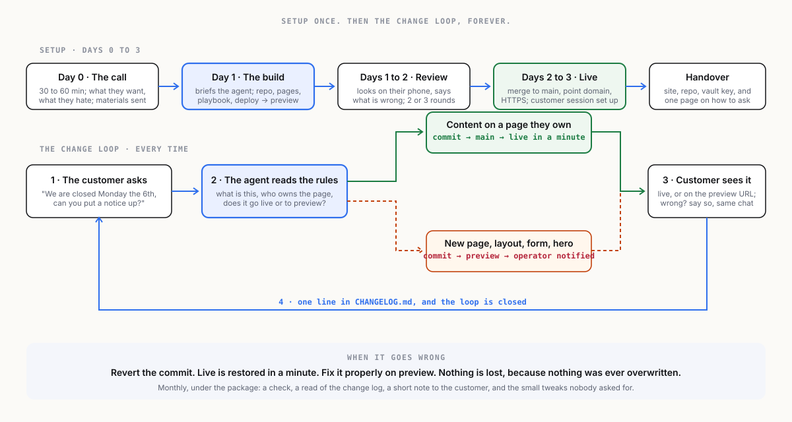

[← The architecture](02-architecture.md) · [Index](00-START-HERE.md) · [Next →](04-what-you-sell.md)

# 3 · The workflow

## Setup: from first call to live site

| Day | Step | Who | What happens |
|---|---|---|---|
| 0 | **The call** | operator + customer | Thirty to sixty minutes. What the business does, who the site is for, what they want it to do, what they hate about the current one. The operator takes notes into the customer's vault. |
| 0 | **The materials** | customer | Logo, photos, the text they already have, opening hours, contact details, the domain login. Sent by whatever the customer finds easy. The operator files them in the vault. |
| 1 | **The build** | operator's session | The operator briefs the agent from the notes and materials. The agent creates the repository, the pages, the images at the right sizes, the playbook, and the deploy, and pushes to `preview`. Usually one working session. |
| 1 to 2 | **The review** | customer | The customer opens the preview URL on their phone and says what is wrong. The operator's session fixes it. Two or three rounds is normal. |
| 2 to 3 | **Go live** | operator | Merge to `main`, point the domain, confirm HTTPS. The customer's session is set up with the playbook, and the customer is shown how to ask for a change. |
| 3 | **The handover** | operator | The customer receives: the live site, the repository (theirs), the read key to their vault (brief, materials, notes, playbook), and one page explaining how to change things and what to do if something looks wrong. |

## Maintenance: the change loop

This is the product working as designed, and it is short on purpose.

1. **The customer asks.** In their own session, in their own words: *"We are closed on Monday the 5th, can you put a notice on the home page and change the hours?"*
2. **The agent does it.** It reads the playbook, edits the page, writes a plain-language commit message, and pushes. Small content changes go to `main` and are live in a minute. Anything the playbook marks as needing a look goes to `preview` and the operator is notified.
3. **The customer sees it.** On the live site or on the preview URL. If it is wrong, they say so, in the same conversation, and it is fixed.
4. **It is logged.** `CHANGELOG.md` gets a line. The customer can see every change ever made, and so can the operator.

## What goes to the operator

The playbook decides. A good default:

| Direct to live, from the customer's session | To preview, operator notified | Operator only |
|---|---|---|
| Text edits on existing pages | New pages or sections | Structure and navigation changes |
| Opening hours, prices, contact details | Layout changes | Design and brand changes |
| Swapping or adding photos | Anything touching the home page hero | Domain, DNS, deploy, third-party embeds |
| A notice or announcement | Forms and embeds the customer wants added | Anything the agent flags as unsure |

## Monthly, under the maintenance package

- A check that the site is up, HTTPS is valid, links work, images load, and the preview branch is not carrying something forgotten.
- A read of the change log: what the customer has been asking for, which is also the upsell signal.
- A short note to the customer: what changed this month, what the operator noticed, one suggestion.
- Small tweaks the operator spots, done without being asked and mentioned in the note.

That note is the subscription earning its keep, and it is the thing the template builders never send.

## When it goes wrong

A change breaks the layout. The customer's session does something odd. A photo is enormous. The answer is the same every time: **revert the commit**, live is restored in a minute, and the operator's session fixes the change properly on `preview`. Nothing is lost, because nothing is ever overwritten. This is the single biggest advantage over every template builder, and it comes free with the architecture.

---

[← The architecture](02-architecture.md) · [Index](00-START-HERE.md) · [Next →](04-what-you-sell.md)
