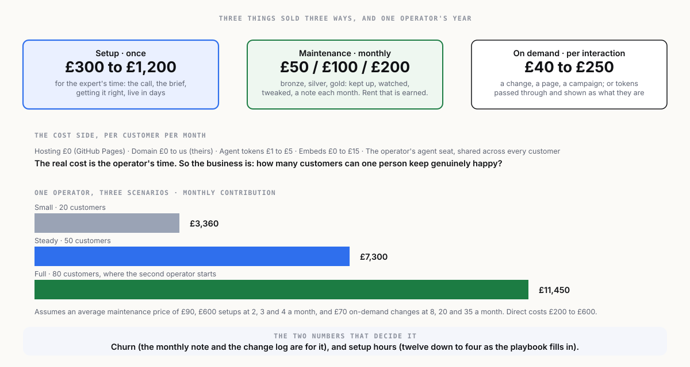

[← What you sell](04-what-you-sell.md) · [Index](00-START-HERE.md) · [Next →](06-go-to-market.md)

# 5 · The business model

## The cost side is nearly empty

| Cost | Per customer, per month | Notes |
|---|---|---|
| Hosting | £0 | GitHub Pages, public repository. |
| Domain | £0 to the operator | The customer owns and pays for it, about £10 to £15 a year. |
| Agent tokens for changes | £1 to £5 | A typical content change costs pence in tokens; a busy month a few pounds. Metered, or absorbed in the package. |
| The operator's agent seat | about £20 to £200 a month, **shared across all customers** | One Claude or ChatGPT plan supports the operator's sessions for every customer. |
| Third-party embeds | £0 to £15 | Forms and bookings have free tiers; paid tiers are passed to the customer. |
| **Operator time** | **the real cost** | Setup: 4 to 12 hours. Maintenance: 20 to 90 minutes a month depending on package. |

So the gross margin on maintenance is very high, and the business is entirely about **how many customers one operator can keep genuinely happy**. That is the number to watch.

## Capacity

A working assumption for one operator, full time, once the playbooks are in place:

| Activity | Hours per month |
|---|---|
| Setups, at 3 a month averaging 8 hours | 24 |
| Maintenance, 50 customers averaging 45 minutes | 38 |
| On-demand changes, 20 a month at 45 minutes | 15 |
| Sales, admin, the monthly notes | 30 |
| **Total** | **107** of about 160 available |

Fifty customers is comfortable for one person. Eighty is the ceiling before a second operator, and the second operator is the moment the playbooks prove they are playbooks.

## Three scenarios, one operator

Average maintenance price assumed at £90 (a mix of bronze, silver and gold). Setup average £600. On-demand average £70.

| | Small | Steady | Full |
|---|---|---|---|
| Customers on maintenance | 20 | 50 | 80 |
| Monthly recurring revenue | £1,800 | £4,500 | £7,200 |
| Setups per month | 2 | 3 | 4 |
| Setup revenue per month | £1,200 | £1,800 | £2,400 |
| On-demand changes per month | 8 | 20 | 35 |
| On-demand revenue per month | £560 | £1,400 | £2,450 |
| **Revenue per month** | **£3,560** | **£7,700** | **£12,050** |
| Direct costs per month (tokens, seats, embeds) | £200 | £400 | £600 |
| **Contribution per month** | **£3,360** | **£7,300** | **£11,450** |
| Annual contribution | £40,320 | £87,600 | £137,400 |

The Small column is a viable one-person business from month six. The Steady column is a good one. The Full column is where the second operator starts. None of these needs outside money, and that is a feature, because the next section is about why an investor would want in anyway.

## The two things that decide the numbers

1. **Churn.** A customer who leaves after six months was worth £540 of maintenance plus their setup. One who stays three years is worth £3,240 plus the upsells. The monthly note and the visible change log are the churn tools. Track it from customer one.
2. **Setup time.** The first setup takes twelve hours. The twentieth takes four, because the playbook, the templates and the agent's instructions are reusable. Every hour off the setup is margin or a lower price, and a lower price is a bigger market.

## The rule from the operating model

Be profitable before you raise. This business can be profitable inside a year with one operator and no capital beyond a laptop, an agent seat and a domain for the sales site. Do that first. Then the conversation with an investor is about growth, not survival.

---

[← What you sell](04-what-you-sell.md) · [Index](00-START-HERE.md) · [Next →](06-go-to-market.md)
