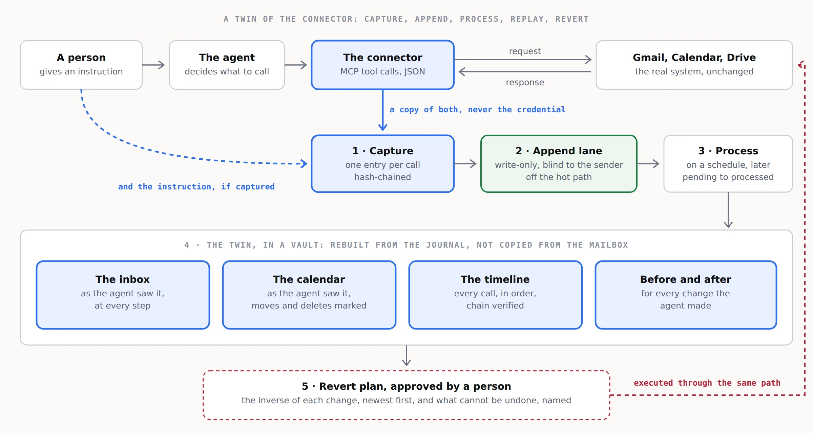

# 3. Architecture

Five steps. Four of them exist today; the fourth needs a decision more than it needs code.

## 1. Capture

For every connector call, capture three things:

- **The tool call** the agent made, as the connector protocol carried it. For MCP that is a JSON-RPC `tools/call` request and its result.
- **The upstream request and response** the connector exchanged with the platform: method, URL, body, status, response body. This is the part that lets the views be rebuilt, because it holds the platform's own answer.
- **The instruction** that led to the call, when prompt capture is on: the user's request, and the agent's own statement of what it did.

Never capture the `Authorization` header, cookies, or any token. Capture is of content, not of credentials. The entry format is in `spec/journal-entry.md`.

Where the capture runs is a choice with consequences; see `04-the-service.md` and `diagrams/capture-modes.webp`.

## 2. Append

Each entry is written to a vault append lane. Three properties make this the right primitive:

- **Write-only and blind.** The writer holds a token that lets it append and nothing else. The response is `{"ok": true}` and nothing more, so a compromised capture point learns nothing about what else is in the lane.
- **Off the hot path.** An append is one small POST. It is not decrypted, indexed or processed when it arrives, so capture costs the agent almost nothing.
- **Outside the commit tree.** Appends never touch a branch and never conflict with a push, so the journal and the processed views can live in the same vault without contention.

Limits to design around: 5 MB per write, and up to 1,000 pending entries per token before writes are refused. Large attachments are therefore captured by hash and size with the bytes stored separately, and the processor must keep up.

## 3. Chain

Each entry carries `prev`, the hash of the entry before it, and `hash`, its own SHA-256 over a canonical serialisation. A missing entry, an edited entry, or entries out of order all show. `tools/verify-journal.py` checks the chain offline; the app checks it in the browser.

The chain proves the journal was not altered after capture. It does not prove the capture was complete. Completeness comes from the capture mode, not from the chain.

## 4. Process

A scheduled reader lists pending entries, fetches them in batches, folds them into per-connector views, commits the views to the vault, and marks the entries processed. Marking is idempotent, so a retry after a timeout is safe.

The open question is the schedule. Options, with their costs, are in `prototypes/processor-schedule.md`. The short version: process on a timer for steady load, on a pending-count threshold to stay clear of the 1,000 limit, and on demand when somebody opens the replay.

## 5. Replay and revert

A vault app rebuilds the views from the processed journal: the inbox as the agent saw it, the calendar as the agent saw it, the timeline, a before and after for every write, and a revert plan. The app in this vault is the reference implementation, running on invented data.

The revert plan is advice, not action. Executing it is a separate step, approved by a person, performed through the same capture path so the revert itself is journalled. The rules per action are in `spec/revert-rules.md`.

## Where the keys live

The journal holds copies of email and calendar content, so it is as sensitive as the mailbox. It is encrypted before it leaves the capture point, stored as ciphertext the host cannot read, and opened with a key the customer holds. In the Assured tier the keys never leave the customer. Key custody is the least glamorous part of the design and the one a customer's security team will ask about first.
