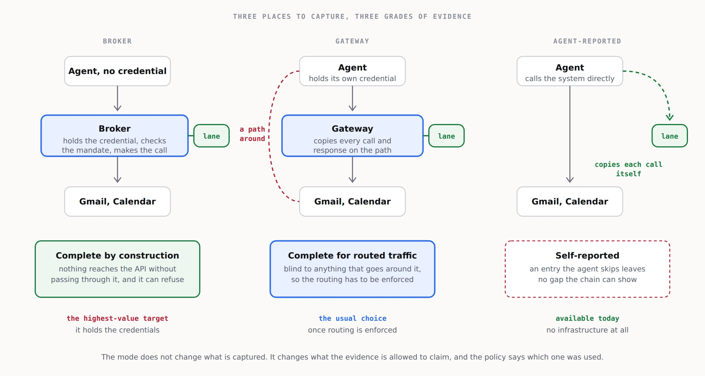

# 4. The service

## What the customer gets

- **A connector review.** Which agents are connected to what, with which scopes, and which of the actions those scopes allow cannot be undone by the platform. For Gmail with the full scope, that list includes permanent delete; for any mail scope that can send, it includes send; for Calendar, it includes every notification to attendees.
- **Capture** in one of three modes, set up and tested.
- **The journal**, encrypted, retained for the tier's period, searchable, chain-verified.
- **The twin**: the rebuilt views, the timeline, before and after, and revert plans.
- **Evidence** for the agent behaviour policy: what the agent could do, what it did, what could not be undone, each month.
- **Replay on demand** when something goes wrong: what the agent saw, what it did, what it said it did, and what can be put back.

## Packages

| | Price | For |
|---|---|---|
| Connector review, small | £750 once | Up to 3 connectors and 5 agents |
| Connector review, team | £2,500 once | Up to 10 connectors and 25 agents, with a replay drill |
| Connector review, organisation | £6,000 once | Larger estates, with the customer-cloud deployment and an incident runbook |
| Journal | £15 per agent per month | Capture, 90 days of encrypted retention, search, chain verification |
| Twin | £40 per agent per month | Journal plus views, before and after, revert plans, 1 year of retention |
| Assured | £90 per agent per month | Twin plus a monthly evidence pack, two incident replays a year, retention to 7 years, customer-held keys |
| Incident replay | £900 per incident | A day's investigation |
| Supervised revert | £450 per incident | Executing the revert plan with the customer, journalled |

Minimum £150 a month. Every price is a hypothesis to test with the first ten customers.

## Capture modes

| Mode | How it works | Evidence grade | Best for |
|---|---|---|---|
| **Broker** | A service between the agent and the platform holds the credentials and makes the calls. The agent never holds a platform token. | Complete: nothing reaches the API without passing through it. | Regulated customers, the Assured tier. |
| **Gateway** | A proxy on the MCP or HTTP path copies each call and response into the lane. The agent keeps its own credentials. | Complete for routed traffic, blind to anything that goes around it. | Most customers, once routing is enforced. |
| **Agent-reported** | The agent is instructed to append a copy of every request and response itself. | Self-reported: an omitted entry leaves no gap the chain can show. | Day one, pilots, and agents you cannot put a proxy in front of. |

The mode does not change the price. It changes what the monthly evidence pack is allowed to say, and it is stated on every page of it.

## Where it runs

- **Hosted.** You run the broker or gateway and the processor; the journal is stored as ciphertext. Be explicit with the customer: a hosted broker or gateway sees traffic in flight, even though what it stores it cannot read.
- **Customer cloud.** The broker, gateway and processor run as containers in the customer's account; you ship the software and support it. A platform licence of £500 a month on top of the per-agent price is a reasonable starting point.
- **Agent-reported.** No infrastructure at all beyond the vault and its append lane.

## What you do not do

- Store platform credentials outside the broker.
- Execute a revert without a person's approval.
- Claim completeness for agent-reported capture.
- Keep a full copy of a mailbox. If the agent did not touch it, the twin does not have it.
