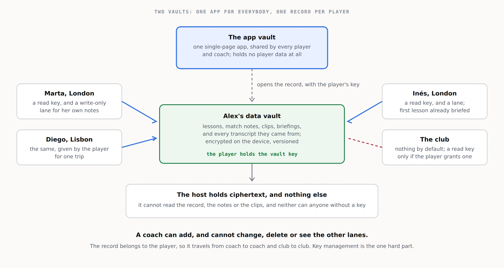

# 3. Architecture

## The pieces

| Piece | What it is | Where it lives |
|---|---|---|
| **Voice capture** | The coach's two- or three-minute memo. | Claude, ChatGPT or a transcription app, on the coach's phone. |
| **The agent** | Turns the transcript into a lesson note and a player view, and later writes briefings. | The same assistant, with `prototypes/coach-memo-prompt.md`; or a vault app calling a model through the host. |
| **The app vault** | The single-page app that shows a record: the timeline, notes, the player view, briefings, themes. | One vault, shared by every player and coach. |
| **The data vault** | One player's record: notes, match notes, clips, briefings, and the memos they came from. | One vault per player. The player holds the vault key. |
| **Append lanes** | Write-only channels into the data vault, one per coach. | The vault server; documented at sgit.ai/api/append-lanes.html. |

## Who holds what

- **The player** holds the data vault's key. It is their record.
- **Each coach** gets a read key, to see the record, and an append token for their own lane, to add memos and notes. A coach cannot change or delete anything, and cannot see which other lanes exist.
- **The club**, where it provides the service, can hold nothing at all, or a read key the player grants.
- **The host** holds ciphertext, and cannot read any of it.

## The flow in phase one

1. The coach records the memo in their assistant at the end of the lesson.
2. The assistant turns it into a lesson note using the prompt.
3. The note, and the transcript it came from, are appended to the player's lane.
4. The next time the record is opened, pending entries are folded into it.
5. The player reads the note in the app. Before the next lesson, the coach reads a briefing.

## The one hard part

Key management. A player has to keep a vault key safe, hand out read keys to coaches, and take them back. That is the problem sgit.ai's call for collaboration with password managers and identity providers exists to solve. Until it is, phase one should keep the number of keys small: one data vault per player, one read key per coach.
