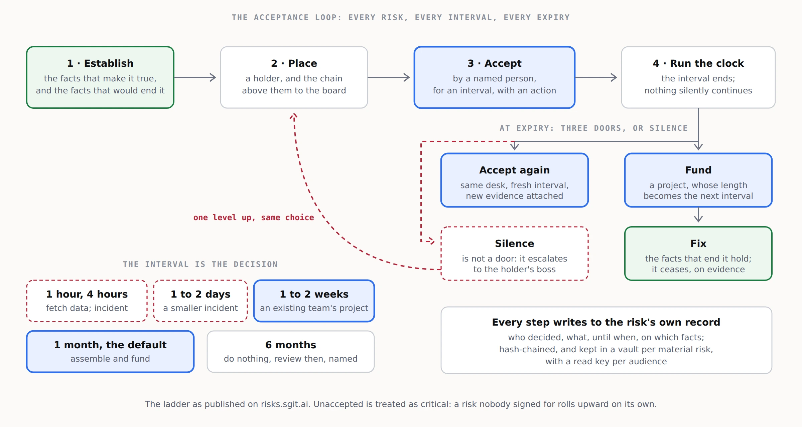

# 3. The operating model

The service runs one loop, over and over, for every material risk a client carries. Everything else in the company exists to run that loop well.

## The loop, for one risk

1. **Establish.** Find the facts that make the risk true, with their sources: a configuration, an access list, a log, an answer from the person who knows. Write down the facts that would end it. A risk with no "established by" fact is an opinion, and it does not enter the loop.
2. **Place.** Give it a holder, and compute the chain above the holder to the board. Nothing is reported upward by hand; arrival is derived from the chain.
3. **Accept.** The holder accepts it personally, for an interval chosen from the ladder, with the action that will happen before the interval ends. Nobody accepts on anybody else's behalf.
4. **Run the clock.** When the interval ends, the risk is accepted again, escalated to the holder's boss, funded, or fixed. It never silently continues.
5. **Escalate or fund.** An expired acceptance that is not renewed goes up one level, where the choice is the same: accept, fund or fix. Funding creates a project, and the project's duration becomes the next interval.
6. **Treat incidents as short intervals.** When the interval is hours or days, the organisation is not managing a risk any more; it is responding to one. The loop opens an incident, and the incident's closure is the evidence the next acceptance needs.
7. **Close on facts.** A risk ceases when the facts that end it hold, and that is recorded with their sources. It is not closed by opinion, or by the review date passing.

Every step writes to the risk's own record: who decided, what, until when, on which facts. For material risks, that record lives in a vault.

## A vault per material risk

A material risk earns a vault of its own: the facts and their sources, the controls, the decisions, the history and the acceptance record, hash-chained and encrypted, openable by each audience with its own read key. The board gets a read key, the auditor gets another, and the holder can write. `spec/risk-vault.md` sets out the layout. The replay in `index.html` is one such vault, invented.

This is also what makes the register fractal. A corporate line opens into the business, operational and technical risks beneath it, each with its own holder and its own vault if it is material, and the same grammar applies at every altitude.

## Roles in the company

| Role | What they do |
|---|---|
| **Risk engineer** | Runs the loop for a portfolio of client risks: establishes facts, keeps the clocks, prepares acceptances and escalations. |
| **Engagement lead** | Owns the client relationship and the board-level conversations. The person who can sit in front of an audit committee. |
| **Integration engineer** | Connects the client's GRC platform, identity system and evidence sources, and keeps the write-back working. |
| **Method lead** | Owns the playbook, trains partners, and keeps the ladder and the rules consistent across clients. |

## The weekly and quarterly rhythm

- **Weekly, per client:** clocks due in the next fortnight, escalations raised, incidents open, funding decisions pending.
- **Monthly, per client:** the acceptance report for the executive team: what each person holds, until when, and what happens next.
- **Quarterly, per client:** the board pack. Every risk that arrives at the board, with its chain, its current acceptance and the evidence beneath it.

## What the service never does

- Accept a risk on the client's behalf.
- Rate a risk without the facts that establish it.
- Replace the client's GRC platform.
- Hold the client's keys.
